\newpage{}

# Instruction Level Parallelism (ILP) and its exploitation

## Che cos'è il pipelining?
Il **pipelining** è una tecnica utilizzata nei processori moderni per diminuire il tempo di esecuzione dei programmi. Il pipelining è una tecnica implementativa che consiste nell'introdurre una pipeline all'interno dell'architettura del microprocessore. L'introduzione di una pipeline permettere di "eseguire" più istruzioni contemporaneamente. Ora la domanda sorge spontanea: come funziona un processore pipelined? 

## Come funziona un processore pipelined?
Un istruzione, durante la sua esecuzione, percorre una *linea di montaggio* nel quale, ad ogni *stage*, vengono eseguite delle micro-operazioni (ovvero delle operazioni compiute dal hardware) atte ad eseguire 

1. Il prelievo dell'istruzione (*instruction fectch*). 
1. La decodifica (*instruction decode*). 
1. L'esecuzione (*instruction execution*). 
1. Un eventuale accesso alla memoria (*memory access*). 
1. Un eventuale scrittura su registro (*write-back*). 

Ad ogni stage della linea di montaggio, il microprocessore utilizza delle unità funzionali diverse rendendo ogni stage indipendente dallo stage precedente e dallo stage succesivo. L'indipendenza tra stage è una proprietà che riguarda solo le unità funzionali del microprocessore, mentre, i risultati prodotti dallo stage $i$ sono necessari per le operazioni condotte dallo stage $i+1$. Di conseguenza uno stage deve neccesariamente attendere i risultati dello stage precedente affinchè sia garantita la corretta esecuzione di ogni istruzione. Morale della favola: presa in considerazione un'istruzione, ad ogni ciclo di clock può essere attivo solo uno stage della linea di montaggio. Attenzione: ad ogni ciclo di clock, solo un sottoinsieme delle unità funzionali è attivo! Questo significa che non stiamo sfruttando a pieno le risorse del processore (quindi misureremo un throughput inferiore al massimo ottenibile) ma soprattutto abbiamo un CPI di 5 (5 cicli di clock per completare un'istruzione). Il pipelining ci permette di ottenere, in teoria, un CPI di 1 (1 ciclo di clock per completare una istruzione). Come è possibile? La tecnica del pipelining nasce dalla seguente intuizione: possiamo sovrapporre l'esecuzione di più istruzioni visto che ad ogni ciclo di clock un'istruzione occupa un solo stage della linea di montaggio!  

Analizziamo un esempio:

- Al ciclo di clock $C_{i}$ viene eseguita la fase di fetch dell'istruzione $i$.
- Al ciclo di clock $C_{i+1}$ viene eseguita la fase di decodifica dell'istruzione $i$. Quindi, durante il ciclo di clock $C_{i+1}$ l'istruzione $i$ occupa le unità funzionali che compiono la decodifica dell'istruzione. Tutte le altre unità funzionali sono inattive (comprese le unità che si occupano del fetch di una nuova istruzione). Dunque, il microprocessore pipelined può iniziare una nuova fase di fetch: al ciclo di clock $C_{i+1}$ viene eseguita la fase di fetch dell'istruzione $i+1$!
- Al ciclo di clock $C_{i+2}$ vengono eseguite 
    - La fase di esecuzione dell'istruzione $i$,
    - La fase di decodifica dell'istruzione $i+1$.
    - Inoltre, visto che lo stage di fetch è stato liberato dall'istruzione $i+1$, il microprocessore pipelined esegue la fase di fetch dell'istruzione $i+2$.
- E così via.

Vediamo un esempio concreto:

|**Instruction**|$C_{1}$|$C_{2}$|$C_{3}$|$C_{4}$|$C_{5}$|$C_{6}$|$C_{7}$|$C_{8}$|$C_{9}$|
|:---|----:|:---:|:---:|:---:|:---:|:---:|:---:|:---:|:---:|
| $i$   |\texttt{IF}|\texttt{ID}|\texttt{EX}|\texttt{MEM}|\texttt{WB}|    |    |    |    |
| $i+1$ |    |\texttt{IF}|\texttt{ID}|\texttt{EX}|\texttt{MEM}|\texttt{WB}|    |    |    |
| $i+2$ |    |    |\texttt{IF}|\texttt{ID}|\texttt{EX}|\texttt{MEM}|\texttt{WB}|    |    |
| $i+3$ |    |    |    |\texttt{IF}|\texttt{ID}|\texttt{EX}|\texttt{MEM}|\texttt{WB}|    |
| $i+4$ |    |    |    |    |\texttt{IF}|\texttt{ID}|\texttt{EX}|\texttt{MEM}|\texttt{WB}|

La tabella riportata sopra raffigura, per ogni ciclo di clock, in quale stage si trova ogni istruzione. Come è facile notare, ad ogni ciclo di clock, tutte le istruzioni occupano uno stage diverso (non ci sono conflitti, o almeno apparentemente) ed a partire da $C_{5}$ possiamo misurare uno CPI = 1!

Grazie a questa tecnica siamo in grado di diminuire il tempo di esecuzione dei programmi perchè ora siamo in grado di eseguire istruzioni più velocemente:

- Con una pipeline composta da 5 stage, a partire dal 5° ciclo di clock, possiamo misurare un throughput di 1 istruzione per ciclo di clock.
- Con un microprocessore che esegue ogni istruzione suddividendola nelle stesse 5 fasi elencate precedentemente, l'assenza della pipeline determina un degrado delle prestazioni visto che l'esecuzione di un'istruzione necessita di 5 clock ma l'istruzione successiva potra essere eseguita solo dopo che l'istruzione precedente è giunta a termine. Morale della favola: un processore non pipelined ha un CPI di 5 (1/5 istruzioni per ciclo di clock).

## Pipeline Hazards\label{section:pipeline_hazards}
Ovviamente, anche il pipelining ha dei pregi e dei difetti.

**Pregi**

- Seppur il tempo di esecuzione necessario per eseguire un'istruzione aumenta rispetto al caso non pipelined[^1], il throughput[^2] aumenta e di conseguenza diminuisce il tempo di esecuzione dei programmi.

**Difetti**

- Overhead introdotto dalla logica combinatoria necessaria per la gestione della pipeline.
- Pipeline hazards.
- Pipeline stalls.

[^1]: In un microprocessore pipelined, il periodo di clock è leggermente maggiore, rispetto ad un microprocessore classico, per eseguire tutte le micro-operazioni previste dalla logica di controllo della pipeline.

[^2]: Si intende il throughput misurato come numero di istruzioni eseguite nell'unità di tempo.

Ci sono delle situazioni in cui non è possibile eseguire la prossima/e istruzione/i al ciclo di clock successivo/i. Tali situazioni sono dette **hazards** e causano lo *stallo* della pipeline. 

Gli hazards sono suddivisi in tre classi:

- **Structural hazards** - Gli hazard strutturali sono causati dai conflitti che possono accadare quando due istruzioni necessitano, durante un ciclo di clock, di accedere alla stessa unità funzionale per proseguire l'esecuzione.
- **Data hazards** - Gli hazard sui dati sono causati da istruzioni che presentano dipendenze sugli operandi. Esempio: l'istruzione successiva a quella corrente non può essere eseguita perchè prevede come operando il risultato prodotto dall'istruzione corrente. Finchè l'istruzione corrente non è giunta a termine, l'istruzione successiva è costretta ad attendere (causando uno stallo della pipeline).

- **Control hazards** - Gli hazard di controllo sono causati da istruzioni che cambiano il flusso di esecuzione (quindi modificano il registro PC). La pipeline non può proseguire finchè non è noto come il risultato dell'istruzione corrente modifica il flusso di esecuzione.

Abbiamo già accennato che un hazard può rendere necessario lo stallo della pipeline. In particolare, può accadere che un hazard riguardi solamente l'istruzione immediatamente successiva. Per semplicità, studiamo un meccanismo di pipeline che blocca l'esecuzione di ***tutte*** le istruzioni successive fino a quando l'istruzione corrente giunge a termine. Ora andiamo a studiare più nel dettaglio le tre classi di hazards.


**Structural hazards** - Quando si adotta un processore pipelined, l'esecuzione sovrapposta di più istruzioni può rendere necessario la duplicazione delle unità funzionali in modo tale da risolvere i possibili conflitti che nascerebbero se due (o più) istruzioni richiedo l'accesso, entrambe, alla risorsa *R* durante il ciclo di clock $C_{i}$. Talvota non è possibile duplicare le unità funzionali perchè richiederebbe un costo di produzione maggiore e/o consumi energetici maggiori. Quindi, a discapito delle prestazioni, a volte si prende atto del fatto che la pipeline potrebbe *stallare* a causa degli hazards strutturali.

Vediamo un esempio di hazard strutturale. Supponiamo di avere una memoria condivisa tra istruzioni e dati. Prendiamo in esame il seguente codice:

```asm
    LD  R2, $0[R1]
    ADD R5, R4, R3
    SUB R8, R7, R6
    ST  R3, $4[R1]
```

Analizziamo, per ogni ciclo di clock, quali unità funzionali vengono accedute da ogni istruzione:


|**Instruction**|$C_{1}$|$C_{2}$|$C_{3}$|$C_{4}$|$C_{5}$|$C_{6}$|$C_{7}$|$C_{8}$|
|:-------------|:---:|:---:|:---:|:---:|:---:|:---:|:---:|:---:|
|`LD  R2, $0[R1]`|\texttt{Mem}|\texttt{Reg}|\texttt{ALU}|\textcolor{red}{\texttt{Mem}}|\texttt{Reg}|     |     |     |
|`ADD R5, R4, R3`|     |\texttt{Mem}|\texttt{Reg}|\texttt{ALU}|\texttt{Mem}|\texttt{Reg}|     |     |
|`SUB R8, R7, R6`|     |     |\texttt{Mem}|\texttt{Reg}|\texttt{ALU}|\texttt{Mem}|\texttt{Reg}|     |
|`ST  R3, $4[R1]`|     |     |     |\textcolor{red}{\texttt{Mem}}|\texttt{Reg}|\texttt{ALU}|\texttt{Mem}|\texttt{Reg}| 

Hazard! Al ciclo di clock $C_{4}$:

- L'istruzione `LD R2, $0[R1]` accede alla memoria per recuperare il contenuto della cella di memoria puntato da `$0[R1]`.
- L'istruzione `ST R3, $4[R1]` accede alla memoria per eseguire la sua fase di fetch. 

Per poter proseguire è necessario *stallare* la pipeline fino a quando l'istruzione `LD R2, $0[R1]` giunge a termine (in questo caso è sufficiente attendere solo un ciclo di clock).

|**Instruction**|$C_{1}$|$C_{2}$|$C_{3}$|$C_{4}$|$C_{5}$|$C_{6}$|$C_{7}$|$C_{8}$|$C_{9}$|
|:-------------|:---:|:---:|:---:|:---:|:---:|:---:|:---:|:---:|:---:|
|`LD  R2, $0[R1]`|\texttt{Mem}|\texttt{Reg}|\texttt{ALU}|\texttt{Mem}|\texttt{Reg}|     |     |     |     |
|`ADD R5, R4, R3`|     |\texttt{Mem}|\texttt{Reg}|\texttt{ALU}|\texttt{Mem}[^3]|\texttt{Reg}|     |     |     |
|`SUB R8, R7, R6`|     |     |\texttt{Mem}|\texttt{Reg}|\texttt{ALU}|\texttt{Mem}|\texttt{Reg}|     |     |
|`ST  R3, $4[R1]`|     |     |     |*Stall*|\texttt{Mem}|\texttt{Reg}|\texttt{ALU}|\texttt{Mem}|\texttt{Reg}| 

[^3]: L'istruzione `ADD R5, R4, R3` non necessita l'accesso alla memoria durante il ciclo di clock $C_{5}$. Di fatto esiste "un filo" che propaga il risultato dall'uscita dell'ALU al register file in modo tale che, al ciclo di clock successivo, il risultato della `ADD` viene scritto nel registro `R5`.

Ma se avessimo la disponibilità economica per poter dividere la memoria in \texttt{IM} (*instruction memory*) e \texttt{DM} (*data memory*), si potrebbe risolvere l'hazard strutturale senza ricorrere allo stallo? La rispota è **SI**:

|**Instruction**|$C_{1}$|$C_{2}$|$C_{3}$|$C_{4}$|$C_{5}$|$C_{6}$|$C_{7}$|$C_{8}$|
|:-------------|:---:|:---:|:---:|:---:|:---:|:---:|:---:|:---:|
|`LD  R2, $0[R1]`|\texttt{IM}|\texttt{Reg}|\texttt{ALU}|\textcolor{blue}{\texttt{DM}}|\texttt{Reg}|     |     |     |
|`ADD R5, R4, R3`|     |\texttt{IM}|\texttt{Reg}|\texttt{ALU}|\texttt{DM}|\texttt{Reg}|     |     |
|`SUB R8, R7, R6`|     |     |\texttt{IM}|\texttt{Reg}|\texttt{ALU}|\texttt{DM}|\texttt{Reg}|     |
|`ST  R3, $4[R1]`|     |     |     |\textcolor{red}{\texttt{IM}}|\texttt{Reg}|\texttt{ALU}|\texttt{DM}|\texttt{Reg}| 


**Data hazards** - Uno degli effetti prodotti dalla pipeline consiste nella diminuzione dell'intervallo di tempo che intercorre tra la lettura di un operando $o$ da parte dell'istruzione $i+1$ e la scrittura dello stesso operando da parte dell'istruzione $i$. Ciò avviene perchè in un processore pipelined, le istruzioni sono eseguite in *sovrapposizione temporale*. Vediamo quali possono essere gli effetti indesiderati causati dagli *data hazards*. 

Prendiamo in esame il seguente codice:

```asm
ADD R1, R2, R3
SUB R5, R4, R1
```

Possiamo subito notare che l'istruzione `SUB R5, R4, R1` dipende dall'istruzione `ADD R1, R2, R3` visto che la seconda istruzione necessita del risultato della somma tra `R2` e `R3` (la somma viene riposta nel registro `R1`). Cosa succede alla pipeline in una situazione come questa?

|**Instruction**|$C_{1}$|$C_{2}$|$C_{3}$|$C_{4}$|$C_{5}$|$C_{6}$|
|:-------------|:---:|:---:|:---:|:---:|:---:|:---:|
|`ADD R1, R2, R3`|\texttt{IM}|\texttt{Reg}|\texttt{ALU}|\texttt{DM}|\texttt{Reg}|     |
|`SUB R5, R4, R1`|     |\texttt{IM}|\texttt{Reg}|\texttt{ALU}|\texttt{DM}|\texttt{Reg}|

Il risultato della somma tra `R2` e `R3` è disponibile sul registro `R1` al ciclo di clock $C_{5}$ mentre l'istruzione `SUB` preleva il contenuto del registro `R1` al ciclo di clock $C_{3}$. Affinchè l'istruzione `SUB R5, R4, R1` produca il risultato atteso è neccessario stallare la pipeline per 2 cicli di clock!

|**Instruction**|$C_{1}$|$C_{2}$|$C_{3}$|$C_{4}$|$C_{5}$|$C_{6}$|$C_{7}$|$C_{8}$|
|:-------------|:---:|:---:|:---:|:---:|:---:|:---:|:---:|:---:|
|`ADD R1, R2, R3`|\texttt{IM}|\texttt{Reg}|\texttt{ALU}|\texttt{DM}|\texttt{Reg}|     |     |     |
|`SUB R5, R4, R1`|    |*Stall*|*Stall*|\texttt{IM}|\texttt{Reg}|\texttt{ALU}|\texttt{DM}|\texttt{Reg}|


**Control hazards** - Supponiamo di avere il seguente codice:

```asm
    BZ  R1, taken
    SUB R2, R3, R4
    B   cont
taken:
    ADD R2, R3, R4
cont:
    ...
```

Cosa succede alla pipeline quando esegue il codice presentato sopra? Analizziamo il flusso di lavoro della pipeline:

|**Instruction**|$C_{1}$|$C_{2}$|$C_{3}$|$C_{4}$|$C_{5}$|$C_{6}$|
|:---------------|:---:|:---:|:---:|:---:|:---:|:---:|:---:|
|`BZ  R1, taken` |\texttt{IF}|\texttt{ID}|\texttt{EX}|\texttt{MEM}|\texttt{WB}| |
|`SUB R2, R3, R4`| |\texttt{IF}|\texttt{ID}|\texttt{EX}|\texttt{MEM}|\texttt{WB}|

Apparentemente, il flusso di istruzioni elaborato dalla pipeline, così come presentato sopra, non presenta alcuna stranezza. L'istruzione `SUB R2, R3, R4` non ha dipendenze sui dati dall'istruzione `BZ R1, .taken` e, come abbiamo studiato, è in grado di proseguire l'esecuzione *parallelamente* all'istruzione che la precede. Purtroppo, seppur l'esecuzione parallela delle due istruzioni sia fattibile, il programma sarebbe corretto solo nei casi in cui la condizione testata dall'istruzione `BZ` fosse falsa! 

L'istruzione `BZ R1, taken` determina se la condizione di salto è vera/falsa al termine della fase di decodifica[^4] dell'istruzione. Questa significa che possiamo conoscere, con certezza, la prossima istruzione da eseguire non prima della fine del ciclo di clock $C_{2}$ (si noti che la fase di fetch dell'istruzione successiva al branch viene eseguita al'inizio del ciclo di clock $C_{2}$). Tutto ciò cosa implica? Se la condizione di salto risultasse essere vera (*taken branch*) allora l'istruzione che la pipeline dovrebbe eseguire sarebbe `ADD R2, R3, R4`! In sostanza, per garantire la corretta esecuzione del programma, la pipeline deve attendere[^5]! 

[^5]: L'attesa della valutazione della condizione di salto è necessaria affinchè il registro \texttt{PC} possa essere aggiornato correttamente. 

[^4]: Normalmente, è necessario attendere che il ciclo di esecuzione termini per poter conoscere la prossima istruzione da eseguire. Infatti, durante la fase di esecuzione l'ALU determina se l'operando contenuto nel registro specificato dall'istruzione è uguale a $0$. Il risultato del test viene poi utilizzato come variabile di comando di un multiplexer: se l'esito del test è positivo allora il multiplexer invia l'offset `taken` all'*adder* dedicato all'aggiornamento del registro `PC`; se l'esito è negativo allora il registro `PC` viene aggiornato come di consueto. Per poter anticipare l'aggiornamento del registro `PC` possiamo aggiungere un nuovo *adder* che si occupa della valutazione della condizione di salto direttamente nel ciclo di decodifica (fino ad ora dovevamo attendere il ciclo di esecuzione per poter accedere all'ALU). In questo modo occorre attendere un solo ciclo di clock per conoscere l'indirizzo della prossima istruzione da eseguire.

Purtroppo, affinchè il programma esegua correttamente, \underline{dobbiamo stallare la pipeline ogni qual} \underline{volta si incontra un'istruzione che modifica il registro \texttt{PC}}. In realtà possiamo fare di meglio: invece di stallare la pipeline, ripetiamo il ciclo di *fetch* dell'istruzione che segue l'istruzione di branch[^6]. Di fatto la ripetizione del ciclo di fetch non è altro che uno *stallo*: la prima \texttt{IF} non produrrà mai lavoro utile perchè al ciclo di clock successivo viene eseguita nuovamente.

[^6]: Il processore é in grado di accorgersi quando ha prelevato un'istruzione che modifica il registro `PC` grazie alla fase di decodifica. Ogni qual volta che il processore decodifica una `BZ`, `BNZ` o una semplice `B`, ripete il ciclo di fetch al ciclo di clock successivo.

Il codice del nostro esempio sarà eseguito come segue.

*Untaken branch:*

|**Instruction**|$C_{1}$|$C_{2}$|$C_{3}$|$C_{4}$|$C_{5}$|$C_{6}$|$C_{7}$|
|:---------------|:---:|:---:|:---:|:---:|:---:|:---:|:---:|:---:|
|`BZ  R1, taken`|\texttt{IF}|\texttt{ID}|\textcolor{green}{\texttt{EX}}|\texttt{MEM}|\texttt{WB}| |
|`SUB R2, R3, R4`| |\texttt{IF}|\texttt{IF}|\texttt{ID}|\texttt{EX}|\texttt{MEM}|\texttt{WB}|

*Taken branch:*

|**Instruction**|$C_{1}$|$C_{2}$|$C_{3}$|$C_{4}$|$C_{5}$|$C_{6}$|$C_{7}$|
|:---------------|:---:|:---:|:---:|:---:|:---:|:---:|:---:|:---:|
|`BZ  R1, taken`|\texttt{IF}|\texttt{ID}|\textcolor{green}{\texttt{EX}}|\texttt{MEM}|\texttt{WB}| |
|`SUB R2, R3, R4`| |\texttt{IF}| - | - | - | - | - | 
|`ADD R2, R3, R4`| | |\texttt{IF}|\texttt{ID}|\texttt{EX}|\texttt{MEM}|\texttt{WB}|


Una gestione delle istruzioni di salto come quella presentata sopra è detta *predicted not-taken* (Figura \ref{fig:predicted_not_taken}): 

1. La pipeline esegue la fase di fetch dell'istruzione il cui indirizzo è l'immediatamente successivo all'indirizzo dell'istruzione di salto.
2. La condizione di salto viene valutata durante il ciclo di decodifica dell'istruzione di salto: 
    1. Se la condizione è **falsa** (*not-taken branch*) allora la pipeline prosegue correttamente visto che nello stage di fetch è già presente l'istruzione corretta.
    2. Se la condizione è **vera** (*taken branch*) allora la pipeline trasforma l'istruzione presente nello stage di fetch in una \texttt{nop} ed, al ciclo di clock successivo, preleverà l'istruzione corretta. In questa situazione la pipeline perde un ciclo di clock visto che il lavoro compiuto nel ciclo di fetch dell'istruzione $i+1$ è inutile.


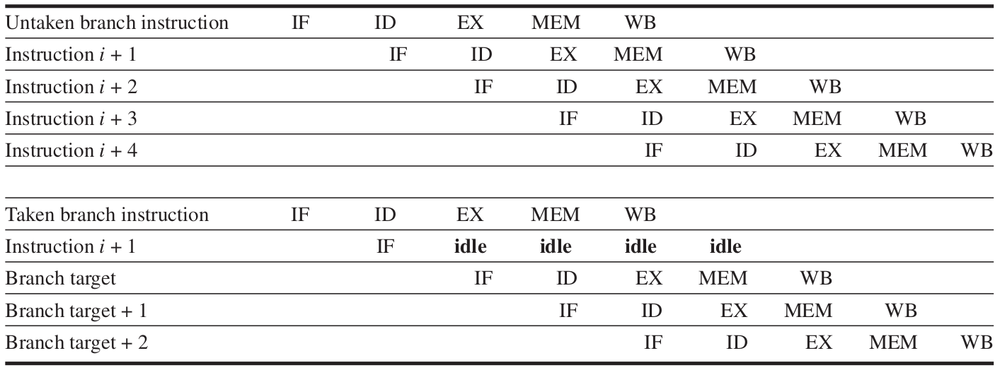

Le performance di un programma dipendono fortemente dai branches! Supponiamo di avere il seguente programma:

```asm
    loop:
	    LD  R1, $0[R2]
	    BNZ R1, taken
	    ADD R1, R1, $1    # vector[i] = 1;
	    ST  R1, $0[R2]
	    SUB R4, R3, R2
	    BZ  ret
	    ADD R2, R2, $4
	    B   loop
    taken:
	    SHL R1            # vector[i] *= 2;
        ST  R1, $0[R2]
	    SUB	R4, R3, R2
	    BZ  ret
	    ADD R2, R2, $4
	    B   loop
    ret:
	    RET
```

* Il programma è molto semplice: 
    1. Carica gli elementi di un vettore di interi[^7] nel registro `R1`.
    2. Se l'elemento corrente è uguale a $0$ (*taken branch*) allora l'elemento viene inizializzato ad $1$.
    3. Se l'elemento corrente è diverso da $0$ (*not-taken branch*) allora l'elemento viene moltiplicato per $2$ (`SHL R1`).
* Supponiamo di eseguire il programma su due vettori la cui distribuzione degli elementi nulli è la seguente:
    - Il $90\%$ degli elementi del primo vettore è nullo.
    - Il $10\%$ degli elementi del primo vettore è nullo.

[^7]: Ad ogni iterazione del ciclo, l'elemento a cui si vuole accedere è puntato dal registro `R2`. 

Come vengono influenzate le perfomance del programma in questione? Tutto dipende dal vettore su cui si esegue il programma! Supponiamo di avere un processore che adotta lo schema *predicted not-taken*:
 
 - Se il programma viene eseguito sul primo vettore, allora perdiamo $\frac{1}{10} \times$ \texttt{lenght(vector)} cicli di clock.
 - Se il programma viene eseguito sul secondo vettore, allora perdiamo $\frac{9}{10} \times$ \texttt{leght(vector)} cicli di clock.

I risultati presentati sopra ci suggeriscono le seguenti osservazioni:

- Le perfomance dei programmi possono dipendere fortemente dalla natura dei dati su cui sono eseguiti. 
- Lo schema *predicted not-taken* è conveniente solo nel caso in cui il programma è fortemente predisposto ad eseguire i *not-taken* branches.

Invece, vorremo uno schema le cui capacità predittive siano migliori rispetto agli schemi discussi in precedenza. In particolare vorremo degli schemi in grado di predirre se il programma eseguirà il ramo *taken* o *not-taken* indipendentemente da: **1)** come è stato scritto il programma e **2)** la natura dei dati di input.

Esistono delle tecniche, dette **branch prediction**, che rispondono alle nostre esigenze:

- **Static** prediction: uno schema di questo tipo prevede l'ottimizzazione dei branches in funzione dei dati ottenuti tramite profiling. In particolare, lo schema sfrutta il fatto che i branches hanno una natura bimodale. Analizzando il comportamento di ogni branch possiamo tradurre il programma in codice assembly in modo tale da favorire lo schema di gestione dei branches presente sulla CPU target. Esempio: se la CPU adotta uno schema di tipo *predicted not-taken* allora possiamo invertire la condizione di tutti gli \texttt{if} predisposti a prendere il ramo *taken*. 
- **Dynamic** prediction: uno schema di tipo dinamico utilizza un *branch-prediction buffer* (oppure una *branch-prediction table*) per scegliere come trattare l'istruzione di branch attualmente in esecuzione. In particolare, se recentemente il branch ha modificato il registro `PC` (*taken branch*) allora il branch predictor schedula l'esecuzione del ciclo di fetch della prima istruzione del ramo *taken*. Se si verifica il caso opposto (*untaken branch*), il branch predictor schedula l'esecuzione del ciclo di fetch della prima istruzione del ramo *untaken*.

\newpage{}

## Minimizzare gli stalli causati da data hazards con la tecnica del *forwarding* \label{section:forwarding}
I data hazards possono essere molto costosi (nell'esempio introduttivo abbiamo dovuto stallare la pipeline per 2 cicli di clock). In realtà esiste un trucchetto hardware che ci consente di mitigare gli stalli causati da data hazards: il *forwarding* (in letteratura, talvolta, ci si riferisce a questo meccanismo hardware con i termini *bypassing* o *short-circuiting*).

Prendiamo in esame il seguente codice:

```asm
    ADD R1, R2, R3
    SUB R4, R2, R1
    AND R5, R3, R1
    OR  R7, R6, R1
```

Le tre istruzioni successive a `ADD R1, R2, R3` hanno come operando sorgente il registro `R1`. Vediamo cosa succede se non stalliamo la pipeline:

|**Instruction**|$C_{1}$|$C_{2}$|$C_{3}$|$C_{4}$|$C_{5}$|$C_{6}$|$C_{7}$|$C_{8}$|$C_{9}$|
|:-------------|:---:|:---:|:---:|:---:|:---:|:---:|:---:|:---:|:---:|
|`ADD R1, R2, R3`|\texttt{IM}|\texttt{Reg}|\texttt{ALU}|\texttt{DM}|\textcolor{green}{\texttt{Reg}}| | | | |
|`SUB R5, R2, R1`| |\texttt{IM}|\textcolor{red}{\texttt{Reg}}|\texttt{ALU}|\texttt{DM}|\texttt{Reg}| | | | |
|`AND R5, R3, R1`| | |\texttt{IM}|\textcolor{red}{\texttt{Reg}}|\texttt{ALU}|\texttt{DM}|\texttt{Reg}| | | |
|`OR  R7, R6, R1`| | | |\texttt{IM}|\textcolor{green}{\texttt{Reg}}|\texttt{ALU}|\texttt{DM}|\texttt{Reg}| |

Per risolvere il problema è necessario stallare la pipeline per 2 cicli di clock:

|**Instruction**|$C_{1}$|$C_{2}$|$C_{3}$|$C_{4}$|$C_{5}$|$C_{6}$|$C_{7}$|$C_{8}$|$C_{9}$|$C_{10}$|
|:---------------|:---:|:---:|:---:|:---:|:---:|:---:|:---:|:---:|:---:|:---:|
|`ADD R1, R2, R3`|\texttt{IM}|\texttt{Reg}|\texttt{ALU}|\texttt{DM}|\textcolor{green}{\texttt{Reg}}| | | | |
|`SUB R5, R2, R1`| |*Stall*|*Stall*|\texttt{IM}|\textcolor{green}{\texttt{Reg}}|\texttt{ALU}|\texttt{DM}|\texttt{Reg}| |
|`AND R5, R3, R1`| | |*Stall*|*Stall*|\texttt{IM}|\textcolor{green}{\texttt{Reg}}|\texttt{ALU}|\texttt{DM}|\texttt{Reg}|
|`OR  R7, R6, R1`| | | |*Stall*|*Stall*|\texttt{IM}|\textcolor{green}{\texttt{Reg}}|\texttt{ALU}|\texttt{DM}|\texttt{Reg}|

L'intuizione alla base del forwarding è semplice: 

* L'istruzione `SUB R5, R2, R1` necessita dell'operando contenuto in `R1` solo quando si trova nella fase di esecuzione (ciclo di clock $C_{4}$). La fase di esecuzione dell'istruzione `SUB R5, R2, R1` dista un ciclo di clock dalla fase di esecuzione dell'istruzione `ADD R1, R2, R3` (ciclo di clock $C_{3}$), ovvero dista un solo ciclo di clock dalla fase di esecuzione dell'istruzione da cui dipende.
* Supponiamo di collegare l'uscita dell'ALU con l'ingresso della stessa unità funzionale. In questo modo, al ciclo di clock successivo, abbiamo a disposizione il risultato prodotto dalla ALU senza dover attendere altri due cicli di clock (ovvero senza dover attendere che l'istruzione precedente giunga a termine).
* L'operando in `R1`, necessario per proseguire l'esecuzione dell'istruzione `SUB R5, R2, R1`, si trova già sull'input dell'ALU quando l'istruzione arriva alla fase di esecuzione: non abbiamo bisogno di stallare la pipeline! Con un po' di logica combinatoria siamo in grado di implementare un circuito che ci permette di scegliere se utilizzare l'operando proveniente dal meccanismo di forwarding oppure se utilizzare l'operando proveniente dal normale flusso di esecuzione dell'istruzione.

Con questa semplice intuizione abbiamo implementato un meccanismo che ci permette di scongiurare uno stallo, altrimenti necessario.

In realtà possiamo generalizzare questo meccanismo propagando il risultato in uscita da un'unità funzionale (non solo ai suoi stessi input ma anche) agli input delle altre unità funzionali. La soluzione così presentata ci permette di risolvere lo stallo (necessario) per poter eseguire correttamente l'istruzione `AND R5, R3, R1`. In Figura \ref{fig:forwarding} possiamo notare che l'istruzione `AND R5, R3, R1` esegue il prelievo degli operandi al ciclo di clock $C_{4}$ ma l'operando corretto si troverà in `R1` solo al ciclo di clock $C_{5}$. Per scongiurare lo stallo è sufficiente collegare l'output dello stage che si occupa dell'accesso in memoria dati[^8] fino agli input dell'ALU.

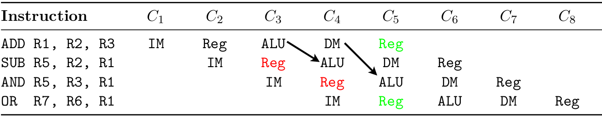

[^8]: Ci riferiamo al 4° stage della pipeline, ovvero allo stage nel quale le istruzioni di \texttt{load} e \texttt{store} accedono alla memoria dati per prelevare/scrivere un operando. Si noti che, tutte le altre istruzioni, non acceddono alla memoria dati: di fatto, ad esclusione delle due istruzioni appena citate, il 4° stage propaga il risultato ottenuto dall'elaborazione dell'ALU fino al 5° stage. Nel 5° stage avviene la scrittura del risultato prodotto dall'ALU sul registro destinazione specificato dall'istruzione.

Purtroppo non tutti i data hazards possono essere risolti con il meccanismo del forwarding. Analizziamo il problema con un esempio:

```asm
    LD  R1, $0[R2]
    SUB R5, R2, R1
```

|**Instruction**|$C_{1}$|$C_{2}$|$C_{3}$|$C_{4}$|$C_{5}$|$C_{6}$|$C_{7}$|
|:------------|:---:|:---:|:---:|:---:|:---:|:---:|:---:|
|`LD R1, $0[R2]`|\texttt{IM}|\texttt{Reg}|\texttt{ALU}|\texttt{DM}|\texttt{Reg}| |
|`SUB R5, R2, R1`| |\texttt{IM}|\texttt{Reg}|\texttt{ALU}|\texttt{DM}|\texttt{Reg}|

L'istruzione `SUB R5, R2, R1` necessita dell'operando in `R1` all'inizio del ciclo di clock $C_{4}$ (ovvero quando "entra" nella fase di esecuzione). L'istruzione `LD R1, $0[R2]`, purtroppo, dispone dell'operando solo alla fine del ciclo di clock $C_{4}$. Affinchè il tutto funzioni senza ricorrere ad uno stallo, il meccanismo di forwarding dovrebbe portare indietro nel tempo l'output della memoria dati fino all'input dell'ALU: purtroppo non abbiamo l'abilità di tornare indietro nel tempo!

Morale della favola: non tutti gli stalli possono essere risolti con il meccanismo del forwarding! Abbiamo bisogno di un meccanismo in grado di rilevare quando un istruzione necessita di un operando non ancora disponibile e, soprattuto, che sia in grado di stallare la pipeline fino a quando l'istruzione da cui dipendono le successive sia giunta a termine.

Soluzione senza *forwarding*:

|**Instruction**|$C_{1}$|$C_{2}$|$C_{3}$|$C_{4}$|$C_{5}$|$C_{6}$|$C_{7}$|$C_{8}$|
|:------------|:---:|:---:|:---:|:---:|:---:|:---:|:---:|:---:|
|`LD R1, $0[R2]`|\texttt{IM}|\texttt{Reg}|\texttt{ALU}|\texttt{DM}|\texttt{Reg}| | |
|`SUB R5, R2, R1`| |\texttt{IM}|\texttt{Reg}|*Stall*|*Stall*|\texttt{ALU}|\texttt{DM}|\texttt{Reg}|

Soluzione con *forwarding*:

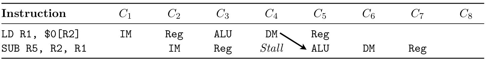


## Dynamic scheduling

Come abbiamo studiato nella Sezione \ref{section:pipeline_hazards}, una pipeline *statica* può incorrere in uno stallo quando il meccanismo di hazard detection rileva un hazard[^9]. Il nostro obiettivo è (e sarà) studiare dei meccanismi che mitigano gli stalli causati dagli hazard. Dal punto di vista delle performance, uno stallo è un evento deleterio in quanto, durante i cicli di clock necessari a risolvere l'hazard, la pipeline non preleva nuove istruzioni. Il nostro obiettivo, dunque, è cercare di aumentare l'utilizzazione della pipeline anche nelle situazioni in cui un'istruzione al suo interno è costretta ad attendere il risultato di un'istruzione che la precede. Se ci pensiamo bene, la soluzione è sempre stata davanti ai nostri occhi: perchè dobbiamo bloccare l'esecuzione di tutte le istruzioni che seguono l'istruzione che non può proseguire? Se permettissimo l'esecuzione delle istruzioni successive (a patto che anche quest'ultime non siano soggette alla stessa dipendenza a cui è soggetta l'istruzione stallata)? Se ciò fosse possibile allora avremo aumentato l'utilizzazione della pipeline perchè, dopo aver individuato un hazard, la pipeline può interrompere l'esecuzione dell'istruzione che ha scaturito l'hazard e proseguire con le istruzioni che seguono. Grazie a questa semplice osservazione abbiamo gettati le basi dell'esecuzione fuori ordine (*out of order execution*)! In realtà non è così semplice: esistono diversi problemi che dobbiamo affrontare prima di poter dire di aver trovato un meccanismo in grado di mitigare gli effetti causati dagli stalli.

[^9]: Uno dei meccanismi hardware atti a risolvere gli hazard è il *forwarding* (lo abbiamo studiato nella Sezione \ref{section:forwarding}).

**Data dependences** - Diciamo che l'istruzione $j$ dipende dall'istruzione $i$ se l'istruzione $j$ utilizza un risultato prodotto dall'istruzione $i$. La definizione appena presentata può essere estesa anche nel caso di una catena di dipendenze: l'istruzione $j$ dipende dall'istruzione $i$ se l'istruzione $j$ utilizza il risultato prodotto dall'istruzione $k$ e l'istruzione $k$ utilizza un risultato prodotto dall'istruzione $i$.

**Name dependences** - Diciamo che l'istruzione $j$ dipende dall'istruzione $i$ quando entrambe leggono o scrivono sullo stesso indirizzo di memoria/registro ma non c'è alcun flusso di dati tra le due istruzioni. Questo tipo di dipendenza è subdolo: la dipendenza tra le due istruzioni non è dettata dalla logica del programma ma semplicemente dal fatto che condividono un registro o una locazione di memoria. Se le due istruzioni non condividessero più il registro (o la locazione di memoria) allora la dipendenza non esisterebbe più perchè le due istruzioni non condividono un flusso di dati che le lega. Esistono due tipi di name dependences:

- *Antidependence:* si ha questo tipo di dipendenza quando un'istruzione $j$ scrive sullo stesso registro su cui un'istruzione $i$ legge un operando. Affinchè l'istruzione $i$ legga il risultato corretto è necessario rispettare l'ordine tra le due operazioni. In particolare, se nel codice l'istruzione $i$ legge dopo che l'istruzione $j$ ha scritto sul registro condiviso, il processore deve conservare l'ordine scrittura$\rightarrow$lettura. Lo stesso discorso è valido nel caso opposto.
- *Output dependence:* si ha questo tipo di dipendenza quando due istruzioni, $i$ e $j$, scrivono sullo stesso registro o sulla stessa locazione di memoria. Risulta necessario rispettare l'ordine specificato dal programma in modo tale che non venga perso il dato scritto dall'istruzione che il programma identifica come quella che deve essere eseguita per ultima.

**Data hazards** - Ma non gli abbiamo già studiati? Si, è vero, ma per affrontare meglio lo studio dello dynamic scheduling è necessario approfondire l'argomento. In particolare, l'obiettivo dell'esecuzione fuori ordine è aumentare il throughput della pipeline permettendo di eseguire le istruzioni in un ordine diverso rispetto a quello specificato dal programma. Attenzione: è possibile eseguire le istruzioni in un ordine diverso da quello specificato dal programma (*program order*) solo nei casi in cui questo non influisce sull'output del programma. L'esecuzione fuori ordine introduce dei nuovi tipi di data hazard perchè modifica l'ordine delle istruzioni e di conseguenza modifica l'ordine temporale delle operazioni di lettura e scrittura. Di seguito analizziamo le tre tipologie di hazard da tenere d'occhio.

**RAW** (read after write) - Supponiamo di avere il seguente codice:
```asm
    ADD R1, R2, R3
    LD	R1, [R4] 
```
L'istruzione `LD R1, [R4]` cerca di leggere il registro prima che l'istruzione `ADD R1, R2, R3` lo abbia prodotto. Questo tipo di hazard è il più comune e corrisponde ad una vera dipendenza dei dati. L'ordine del programma deve essere preservato per garantire che l'istruzione `LD R1, [R4]` riceva l'operando corretto da `ADD R1, R2, R3`.

**WAW** (write after write) - Un hazard di tipo \texttt{WAW} nasce quando un istruzione $j$ cerca di scrivere un operando prima che sia scritto dall'istruzione $i$ ($i$ precede $j$ nel program order). Le scritture vengono effettuate nell'ordine sbagliato, lasciando il valore scritto da $i$ anziché il valore scritto da $j$ nella destinazione. Questo tipo di hazard corrisponde a una dipendenza di output. Gli hazard *WAW* sono presenti solo nelle pipeline che effettuano scritture in più di una fase della pipeline o consentono a un'istruzione di procedere anche quando un'istruzione precedente è bloccata. Fino ad ora non abbiamo incontrato questo tipo di hazard ma l'esecuzione fuori ordine introduce questo problema.

**WAR** (write after read) - Un hazard di tipo \texttt{WAR} nasce quando un istruzione $j$ cerca di scrivere su un registro prima che lo stesso registro venga letto dall'istruzione $i$ ($i$ precede $j$ nel program order), quindi $i$ ottiene erroneamente il nuovo valore. Questo tipo di hazard deriva da una antidependenza (o dipendenza di nome). 

Ora abbiamo tutti gli strumenti per poter introdurre l'esecuzione fuori ordine:

1. La prima unità preleva le istruzioni, le decodifica e invia ciascuna istruzione a una corrispondente unità funzionale per l'esecuzione.
2. Ogni unità funzionale ha buffer, chiamato **reservation station**, che contiene gli operandi e l'operazione.
3. Non appena il buffer contiene tutti gli operandi necessari per eseguire l'istruzione, e l'unità funzionale è pronta per l'esecuzione, il risultato viene calcolato.
4. Una volta che l'unità funzionale ha terminato il suo lavoro, il risultato viene inviato a eventuali *reservation station* in attesa del risultato appena prodotto (**forwarding**) e all'unità di commit, che memorizza il risultato fino a quando sarà possibile compiere la scrittura nel file dei registri o, per uno store, nella memoria.
5. Il buffer nell'unità di commit, spesso chiamato **reorder buffer**, viene anche utilizzato per fornire operandi, in modo molto simile a quanto fa la logica di *forwarding* in una pipeline statica.
6. Una volta che un risultato viene committato nel file dei registri, può essere prelevato direttamente da lì, proprio come in una pipeline normale.

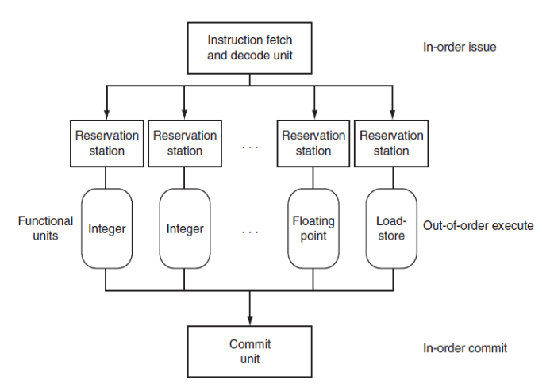

## Register renaming

Gli hazard \texttt{WAR} e \texttt{WAW}, che non sono delle dipendenze sui dati ma derivano dalle dipendenze sui nomi, vengono eliminati tramite la **rinominazione dei registri**. La rinominazione dei registri elimina questi hazard rinominando tutti i registri di destinazione, compresi quelli con una lettura o scrittura in sospeso per un'istruzione precedente, in modo che la scrittura fuori ordine non influenzi nessuna istruzione che dipende da un valore precedente di un operando.

Per comprendere meglio come la rinominazione dei registri elimina gli hazard \texttt{WAR} e \texttt{WAW}, consideriamo la sequenza d'istruzioni che segue:

```asm
    DIV.D  F0,F2,F4
    ADD.D  F6,F0,F8
    S.D    F6,0(R1)
    SUB.D  F8,F10,F14
    MUL.D  F6,F10,F8
```
L'esecuzione fuori ordine, come detto già in precedenza, introduce gli hazard \texttt{WAW} e \texttt{WAR}. Se il codice in esame fosse eseguito su un processore che consente l'esecuzione fuori ordine, allora alcune istruzioni sarebbero soggette ai seguenti hazard:

- L'istruzione `ADD.D F6,F0,F8` dipende dall'istruzione `DIV.D F0,F2,F4` visto che l'istruzione `ADD.D` deve attendere il risultato prodotto dall'istruzione `DIV.D`. In questo caso si ha una dipendenza di tipo \texttt{RAW}.

- L'istruzione `S.D F6,0(R1)` dipende dall'istruzione `ADD.D F6,F0,F8` visto che deve attendere il risultato prodotto dall'istruzione `ADD.D` prima di eseguire la scrittura nella locazione di memoria puntata da `0(R1)`. Anche in questo caso si ha una dipendenza di tipo \texttt{RAW}.

- L'istruzione `SUB.D F8,F10,F14` dipende dall'istruzione `ADD.D F6,F0,F8` visto che l'istruzione `SUB.D` deve attendere che l'istruzione `ADD.D` abbia letto l'operando in `F8` prima di poter scrivere sullo stesso registro. In questo caso si ha una dipendenza di tipo \texttt{WAR}.

- L'istruzione `MUL.D F6,F10,F8` dipende dall'istruzione `S.D F6,0(R1)` visto che, prima di poter scrivere sul registro `F6`, l'istruzione `MUL.D` deve attendere che l'istruzione `S.D` abbia letto l'operando contenuto in `F6`. Anche in questo caso abbiamo una dipendenza di tipo \texttt{WAR}.

- L'istruzione `SUB.D F8,F10,F14` dipende dall'istruzione `ADD.D F6,F0,F8` visto che `SUB.D` deve attendere che l'istruzione `ADD.D` legga l'operando contenuto in `F8` prima di poter scrivere sullo stesso registro. Anche in questo caso abbiamo una dipendenza di tipo \texttt{WAR}.

- Le istruzioni `ADD.D F6,F0,F8` e `MUL.D F6,F10,F8` hanno una dipendenza sull'output visto che entrambe scrivono il risultato della loro esecuzione sul registro `F6`. Per garantire che il risultato prodotto dall'istruzione `MUL.D` non venga sovrascritto dall'istruzione `ADD.D` è necessario **1)** rispettare l'ordine di esecuzione oppure **2)** cambiare il registro di output ad una delle due istruzioni.

Cosa possiamo fare per eliminare le dipendenze di tipo \texttt{WAW} e \texttt{WAR}? Rinominiamo i registri!

|    **Before**    |    **After**      |**Renamed register**|
|:-----------------|:------------------|:------------------:|
|`DIV.D F0,F2,F4`  |`DIV.D F0,F2,F4`   | |
|`ADD.D F6,F0,F8`  |`ADD.D F6*,F0,F8`  |`F6* = F6`|
| `S.D F6,0(R1)`   | `S.D F6*,0(R1)`   |`F6* = F6`|
|`SUB.D F8,F10,F14`|`SUB.D F8*,F10,F14`|`F8* = F8` |
|`MUL.D F6,F10,F8` |`MUL.D F6,F10,F8*` |`F8* = F8` |

Si noti che ogni utilizzo successivo del registro `F8` deve essere sostituito dal registro `F8*`.

L'algoritmo di Tomasulo gestisce il register renaming mediante le **reservation station**.

## Multithreading

Il multithreading consente a più thread di condividere le unità funzionali di un singolo processore in modo sovrapposto. Il multithreading condivide i core del processore tra un insieme di thread, duplicando solo lo stato privato, come i registri e il program counter. Duplicare lo stato privato di un thread significa creare un register file dedicato, un PC (program counter) dedicato e una tabella delle pagine dedicata per ogni thread. La memoria può essere condivisa attraverso i meccanismi di memoria virtuale, che supportano già la multiprogrammazione. Inoltre, l'hardware deve supportare la capacità di passare rapidamente a un thread diverso (**thread context switch**); in particolare, un cambio di thread dovrebbe essere molto più efficiente rispetto a un cambio di processo, che di solito richiede centinaia o migliaia di cicli di processore. Naturalmente, affinché l'hardware possa ottenere miglioramenti delle prestazioni, un programma deve contenere più thread (a volte diciamo che l'applicazione è multithreaded) che potrebbero essere eseguiti in modo concorrente.

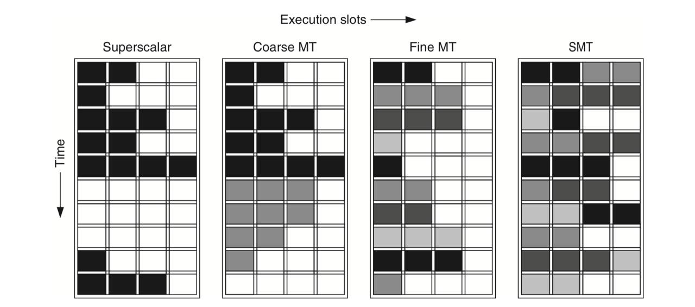

Esistono tre principali approcci hardware al multithreading.

- **Fine-grained multithreading**. Questa tipologia di multithreading passa da un thread all'altro ad ogni ciclo di clock, causando l'interleaving dell'esecuzione di istruzioni appartenenti a thread diversi. Questo interleaving viene spesso eseguito in modo round-robin, saltando eventuali thread che sono bloccati in quel momento. Uno dei principali vantaggi del fine-grained multithreading è che può nascondere le perdite di throughput che derivano da stalli brevi e lunghi, poiché le istruzioni degli altri thread possono essere eseguite quando un thread si blocca, anche se il blocco dura solo alcuni cicli. Lo svantaggio principale del fine-grained multithreading è che rallenta l'esecuzione di un singolo thread, poiché un thread che è pronto per l'esecuzione verrà ritardato dalle istruzioni degli altri thread: si  ottiene un aumento del throughput multithreaded a discapito delle prestazioni (misurate in termini di latenza) di un singolo thread.

- **Coarse-grained multithreading**. Il coarse-grained multithreading effettua un cambio di contesto tra thread solo in caso di stalli costosi, come le cache miss di secondo o terzo livello. Questo cambiamento evita la necessità che il cambio di thread sia poco costoso ed è molto meno probabile che rallenti l'esecuzione di un singolo thread, poiché le istruzioni degli altri thread verranno emesse solo quando un thread incontra uno stallo costoso.

- **Simultaneous multithreading**. L'implementazione più comune del multithreading è chiamata multithreading simultaneo (SMT). Il multithreading simultaneo è una variante del fine-grained multithreading applicata quando il fine-grained multithreading viene implementato su un processore *multiple issue* e *dynamic scheduling*. Come con altre forme di multithreading, l'SMT utilizza il parallelismo a livello di thread per nascondere gli stalli, aumentando così l'utilizzo delle unità funzionali. La chiave dell'SMT è che la rinominazione dei registri e lo dynamic scheduling consentono l'esecuzione di più istruzioni provenienti da thread indipendenti senza tener conto delle dipendenze tra di loro.

\newpage


# Multiprocessors

I **multiprocessors** sono dei sistemi composti da un insieme di processori strettamente accopiati ed il cui controllo è affidato ad un singolo sistema operativo.
I processori condividono tra loro la memoria (quindi possiamo parlare di un sistema a memoria condivisa) attraverso l'utilizzo dello stesso spazio d'indirizzamento. Attenzione: condividere lo spazio d'indirizzamento non significa condividere necessariamente la stessa memoria fisica.

I sistemi di questo tipo sono in grado di sfruttare due diverse tipologie di **thread-parallelism**:

1. **Parallel processing** - Questa tipologia di parallelismo sfrutta il parallelismo sui dati: un insieme di thread che collaborano per eseguire un compito comune sugli stessi dati.

2. **Request-level parallelism** - Questa tipologia di parallelismo è comune nelle applicazioni il cui carico di lavoro è dettato dalle richieste. Facciamo un esempio: un DBMS può sfruttare questa tipologia di parallelismo istanziando un nuovo thread per ogni query. Ora i thread non lavorano più per un task comune (quindi i thread non sono più "legati" tra loro come prima) ma questa tipologia di parallelismo è utile per diminuire il *response time* delle richieste di servizio.

Per sfruttare appieno un multiprocessore MIMD con *n* "core", di solito è necessario avere almeno *n* thread o processi da eseguire. Con il multithreading, presente nella maggior parte dei chip multicore odierni, questo numero è 2-4 volte più elevato.

I thread indipendenti all'interno di un singolo processo sono tipicamente identificati:

- Dal programmatore.
- Creati dal sistema operativo (da richieste multiple indipendenti).
- Possono essere generati da un compilatore che sfrutta il parallelismo dei dati (esempio: le iterazioni di un ciclo).

I thread possono anche essere utilizzati per sfruttare il parallelismo a livello di dati, anche se l'overhead è probabilmente più alto rispetto a quello che si osserverebbe con un processore SIMD o con una GPU. L'overhead introdotto dai thread è "giustificato" se la dimensione del task assegnato a ciascun thread è sufficientemente grande per sfruttare efficientemente il parallelismo. Ad esempio, anche se un processore vettoriale o una GPU possono parallelizzare efficientemente le operazioni su vettori corti, la dimensione del task risultante (quando il parallelismo è diviso tra molti thread) può essere così piccola che l'overhead rende proibitivamente costoso sfruttare il parallelismo in un sistema MIMD.

## Tassonomia dei multiprocessor

I multiprocessori con memoria condivisa esistenti si dividono in due classi, a seconda del numero di processori coinvolti, il che a sua volta determina un'organizzazione della memoria e una strategia di interconnessione. Ci riferiamo ai multiprocessori in base alla loro organizzazione della memoria perché ciò che costituisce un numero piccolo o grande di processori è destinato a cambiare nel tempo.

Il primo gruppo, che chiamiamo **multiprocessori simmetrici** (symmetric multiprocessors, **SMP**), presenta un numero ridotto di core, tipicamente otto o meno. Per i multiprocessori con un così piccolo numero di processori, è possibile che i processori condividano una \underline{singola memoria centralizzata} a cui tutti i processori hanno accesso, da qui il termine "simmetrico". In Figura \ref{fig:multiprocessor_smp} è mostrato come appaiono, da un punto di vista architetturale, i multiprocessori SMP. Negli odierni chip multicore (ovvero nelle moderne CPU), la memoria è condivisa in modo centralizzato tra i core il che rende tutti i multicore esistenti SMP. Le architetture SMP sono talvolta chiamate anche multiprocessori con accesso uniforme alla memoria (Uniform Memory Access, UMA), derivante dal fatto che tutti i processori hanno un tempo d'accesso alla memoria uniforme.

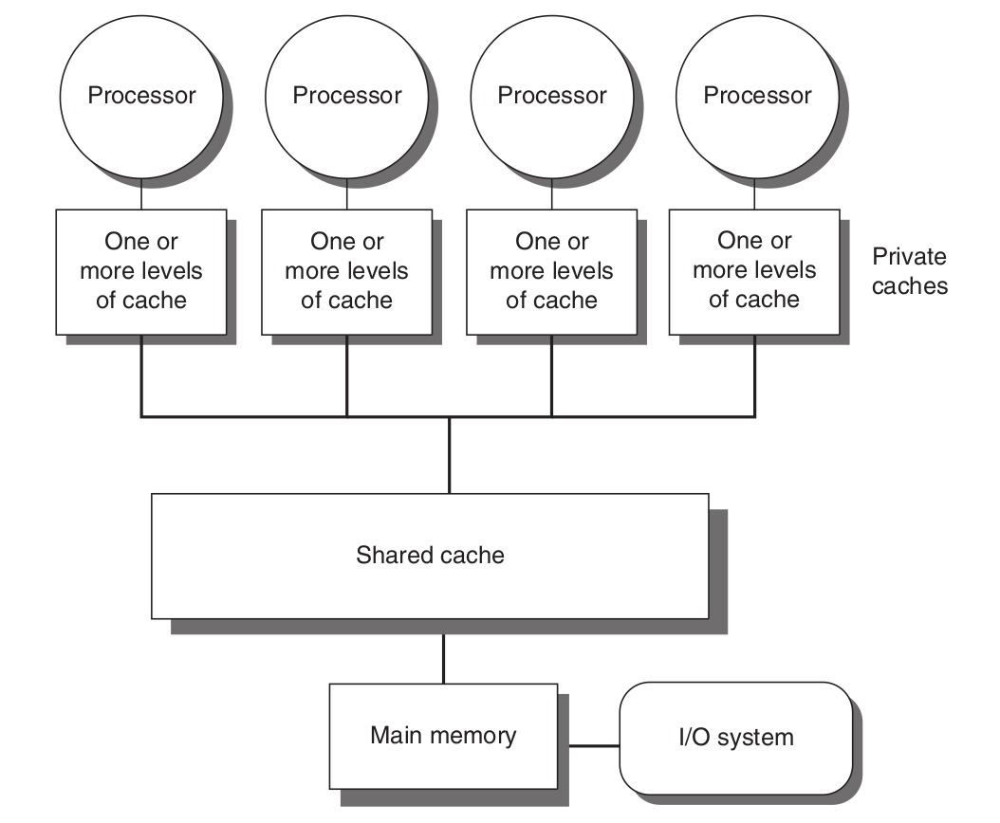

L'approccio alternativo consiste in multiprocessori con memoria fisicamente distribuita, chiamati **multiprocessori** a **memoria condivisa distribuita** (multiprocessors with Distributed Shared Memory, DSM). La Figura \ref{fig:multiprocessor_dsm} mostra come appaiono questi multiprocessori. Per supportare un numero maggiore di processori, la memoria deve essere distribuita anziché centralizzata; se la memoria fosse centralizzata, sistemi di questo tipo andrebbero in crisi perchè la mole di richieste d'accesso alla memoria centralizzta è tale da saturare la banda disponibile (con un conseguente aumento della latenza d'accesso).

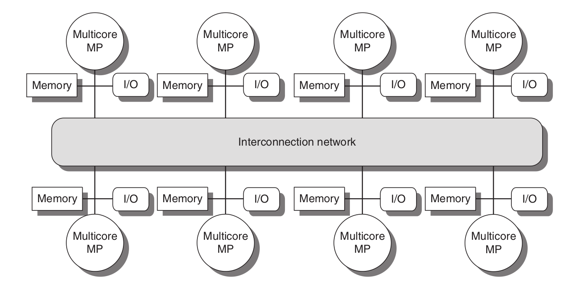

Il multiprocessore DSM è anche chiamato NUMA (NonUniform Memory Access), poiché il tempo di accesso dipende dalla posizione dei dati in memoria. In particolare, visto che i processori condividono lo stesso spazio d'indirizzamento, tutti i processori possono accedere al dato ma il tempo d'accesso tra un processore ed un altro cambia in funzione alla distanza tra il processore e la memoria fisica su cui risiede il dato. I principali svantaggi di un DSM sono che la comunicazione dei dati tra i processori diventa leggermente più complessa e un DSM richiede maggiori sforzi, da parte di chi scrive il software, per sfruttare la maggiore larghezza di banda della memoria offerta dalle memorie distribuite.

Il termine "memoria condivisa" associato sia all'architettura SMP che a quella DSM si riferisce al fatto che lo spazio degli indirizzi di memoria è condiviso tra i processori. In entrambe le architetture, la comunicazione tra i thread avviene attraverso uno spazio degli indirizzi condiviso. Ciò significa che ogni processore può accedere a qualsiasi locazione di memoria all'interno dello spazio degli indirizzi condiviso. I processori possono comunicare tra loro scrivendo e leggendo dati direttamente dalla memoria condivisa.
D'altra parte, nei cluster e nei sistemi warehouse-scale, i singoli computer sono collegati tramite una rete e ciascun processore ha la propria memoria locale. La memoria di un processore non può essere direttamente accessibile da un altro processore senza l'ausilio di protocolli software specifici che gestiscono la comunicazione tra i processori. In queste architetture, vengono utilizzati protocolli di messaggistica per consentire la comunicazione e lo scambio di dati tra i processori.

Purtroppo, la memoria condivisa può diventare un \underline{bottleneck} per le prestazioni e la scalabilità in determinati scenari. Quando più processori o thread cercano di accedere e modificare contemporaneamente la memoria condivisa, possono verificarsi problemi di conflitto e/o sincronizzazione, che portano a una degradazione delle prestazioni.

## Multiprocessor Cache Coherence

Le SMP di solito supportano la memorizzazione nella cache sia di dati condivisi che di dati privati. I dati privati sono utilizzati da un singolo processore, mentre i dati condivisi sono utilizzati da più processori, fornendo essenzialmente comunicazione tra i processori tramite letture e scritture dei dati condivisi. Ovviamente, l'introduzione della memoria cache porta dei vantaggi:

- Nel caso di dati privati, l'utilizzo della memoria cache riduce la latenza (la velocità di lettura/scrittura delle memorie cache è molto maggiore rispetto a quella di una RAM) e il traffico di dati sul bus (tutte le volte che il dato viene acceduto dal processore, ad esclusione della prima volta, la lettura si propaga fino alla cache senza andare sul bus).
- Nel caso di dati condivisi, il dato può essere replicato su più cache. Oltre alla riduzione della latenza di accesso e della banda[^13] richiesta, la replica dei dati condivisi fornisce anche una riduzione dei conflitti d'accesso sui dati che vengono letti contemporaneamente da più processori.

[^13]: Ci si riferisce alla banda occupata sul bus della memoria.

Tuttavia, la memorizzazione nella cache dei dati condivisi introduce un nuovo problema: la **coerenza dei dati**.

Il problema della coerenza esiste perché abbiamo sia uno stato globale, definito dalla memoria principale, che uno stato locale, definito dalle cache, che sono private per ogni core del multiprocessore. Poiché la visione della memoria detenuta da due diversi processori è data dalle loro cache, i processori potrebbero finire per vedere valori diversi per la stessa locazione di memoria. Un esempio di incoerenza sui dati è dato dalla Figura \ref{fig:coherence}.


Un elemento chiave nell'implementazione di un protocollo di coerenza della cache è \underline{tracciare lo stato di condivisione di un blocco di dati}. Esistono due classi di protocolli in uso, ciascuna delle quali utilizza diverse tecniche per tracciare lo stato di condivisione:

1. **Directory based**: lo stato di condivisione di un determinato blocco di memoria fisica viene mantenuto in una posizione chiamata \emph{directory}. Esistono due tipi di protocolli directory-based:
    - Centralizzato. In un SMP, possiamo utilizzare una directory centralizzata associata alla memoria che determina lo stato globale di un dato condiviso (come la cache L3 in una moderna CPU multicore). 
    - Distribuito. In un DSM, non ha senso avere una singola directory, poiché ciò creerebbe un singolo punto di accesso[^14] e renderebbe difficile scalare a molti chip multicore.

2. **Snooping based**: invece di mantenere lo stato di condivisione in una singola directory, ogni cache che ha una copia dei dati di un blocco di memoria fisica può tenere traccia dello stato di condivisione del blocco. In un SMP, le cache sono tipicamente tutte accessibili tramite un mezzo condiviso (esempio: un bus collega le cache di ogni core alla cache condivisa o alla memoria), e tutti i controller della cache monitorano (o fanno \emph{snooping}) il mezzo per determinare se hanno o meno una copia di un blocco richiesto sul bus.

[^14]: Un directory centralizzata, in uno scenario come quello delle DSM, rappresenta un bottleneck perchè sarebbe fonte di ritardi causati dalla gestione degli accessi simultanei. Quest'ultimi, rispetto al caso SMP, sono molti di più visto che il numero di processori è molto maggiore.

## Snooping coherence protocols

Esistono due modi per mantenere coerente lo stato delle cache mediante un protocollo di tipo snooping:

1. Un metodo consiste nel garantire che un processore abbia accesso esclusivo a un elemento di dati prima di scriverlo. Questo tipo di protocollo è chiamato **write invalidate protocol** perché invalida le altre copie durante una scrittura. È di gran lunga il protocollo più comune. L'accesso esclusivo garantisce che non esistano altre copie leggibili o scrivibili di un elemento quando avviene la scrittura: tutte le altre copie in cache dell'elemento vengono invalidate. L'invalidazione avviene mediante una comunicazione broadcast utilizzando un bus condiviso tra tutte le cache. Tuttavia, ciò comporta un costo: se un processore ha bisogno di leggere/scrivere il dato condiviso appena aggiornato, a causa dell'invalidazione, si verifica un miss.

2. L'alternativa alla politica write invalidate consiste nell'aggiornare tutte le copie in cache di un dato condiviso quando tale dato viene scritto. Questo tipo di protocollo è chiamato protocollo **write update**. Poiché un protocollo write update deve trasmettere in broadcast tutte le scritture, richiede una quantità di banda considerevolmente maggiore. Per questa ragione, i multiprocessori recenti hanno scelto di implementare un protocollo write invalidate.

## MSI protocol

Il protocollo **MSI**, acronimo di Modified-Shared-Invalid, è un protocollo di coerenza ampiamente adottato dai sistemi multiprocessore. Si tratta di un protocollo di tipo \emph{write invalidate} che mantiene la coerenza tenendo traccia dello stato di ogni cacheline in un sistema a memoria condivisa.

Il protocollo MSI definisce tre possibili stati per una cacheline:

1. Modified (M): Questo stato indica che il dato contenuto nella cacheline è stato modificato (dal processore associato alla cache in questione) e non è consistente con la memoria principale. Altre cache che possiedono una copia del dato devono invalidare le loro copie per garantire la coerenza.

2. Shared (S): Questo stato indica che il dato contenuto nella cacheline è presente in più cache ed è consistente con la memoria principale. La cacheline può essere letta dai processori, ma le modifiche richiedono la transizione allo stato Modified.

3. Invalid (I): Questo stato indica che una cache non è valida o non esiste nella cache. I processori non possono leggere o scrivere su una cacheline segnata come \texttt{invalid}.

Per eseguire un'operazione di invalidazione, un processore ottiene l'accesso al bus e trasmette in broadcast l'indirizzo della cacheline da invalidare. Tutti i processori nel sistema monitorano continuamente il bus, osservando gli indirizzi trasmessi. Ogni processore verifica se l'indirizzo sul bus corrisponde a una delle cacheline presenti nella propria cache. Se un processore individua una corrispondenza tra l'indirizzo sul bus e un tag nella propria cache, esegue un'operazione di invalidazione. Marcando i dati come non validi, è garantito che il processore non utilizzi più i dati obsoleti e sia obbligato a recuperare (le successive read/write indirizzata alla cacheline non aggiornata produranno una miss) i dati aggiornati dalla memoria principale o da altre cache.

La chiave per implementare un protocollo di invalidazione in un multicore è l'uso del bus, o un altro mezzo di trasmissione broadcast, per eseguire le invalidazioni. Nei vecchi multiprocessori multi-chip, il bus utilizzato per la coerenza è il bus di accesso alla memoria condivisa. In un multicore, il bus può essere il canale di connessione tra le cache private (L1 e L2 nell'Intel Core i7) e la cache esterna condivisa (L3 nell'i7). Per eseguire un'invalidazione, il processore acquisisce semplicemente l'accesso al bus e trasmette l'indirizzo da invalidare.

Se due processori cercano di scrivere due blocchi (contrassegnati come \texttt{shared}) contemporaneamente, i loro tentativi di trasmettere un'operazione di invalidazione verranno serializzati quando si contendono il bus. Il primo processore a ottenere l'accesso al bus provocherà l'invalidazione di tutte le altre copie del blocco che sta scrivendo. Se i processori stavano cercando di scrivere lo stesso blocco, la serializzazione imposta dal bus renderà le loro scritture seriali. Una conseguenza di questo schema è che una scrittura su un dato condiviso non può essere effettivamente completata fino a quando non ottiene l'accesso al bus. Tutti gli schemi di coerenza richiedono un metodo per serializzare gli accessi allo stesso blocco di cache, sia mediante la serializzazione dell'accesso al mezzo di comunicazione o ad un'altra struttura condivisa.

Oltre a invalidare le copie di un blocco di cache in fase di scrittura, è anche necessario individuare un dato quando si verifica un cache miss. In una cache write-through, è facile trovare il valore più recente di un dato, poiché tutti i dati scritti vengono sempre inviati alla memoria, dalla quale è sempre possibile recuperare il valore più recente. (I buffer di scrittura possono portare a qualche complessità aggiuntiva e devono essere adeguatamente trattati). Per una cache write-back, il problema di trovare la copia più recente è più complesso, poiché il valore più recente di un dato può trovarsi in una cache privata anziché nella cache condivisa o nella memoria. Fortunatamente, le cache write-back possono utilizzare lo stesso schema di "snooping" anche per le read miss: ogni processore "snoopa" ogni indirizzo posizionato sul bus condiviso. Se un processore trova di avere una copia "dirty" del blocco di cache richiesto, fornisce quel blocco di cache in risposta alla richiesta di lettura e provoca l'annullamento dell'accesso alla memoria (o L3). La complessità aggiuntiva deriva dal dover recuperare il blocco di cache dalla cache privata di un altro processore (L1 o L2), il che può richiedere più tempo rispetto al recupero dalla L3.

Vale la pena menzionare che esistono variazioni ed estensioni del protocollo MSI, come **MESI** (Modified-Exclusive-Shared-Invalid) e **MOESI** (Modified-Owner-Exclusive-Shared-Invalid), che offrono ottimizzazioni e funzionalità aggiuntive per la coerenza della cache.

## Synchronization

Di solito, i meccanismi di sincronizzazione vengono implementati tramite routine software a livello utente che fanno uso di istruzioni di sincronizzazione fornite dall'hardware. Nei multiprocessori più piccoli (o in situazioni a "bassa contesa"), la chiave per poter implementare un meccanismo di sincroninazzione è un'istruzione (o sequenza di istruzioni) indivisibile in grado di recuperare e modificare atomicamente un valore. I meccanismi di sincronizzazione software vengono quindi costruiti sfruttando questa funzionalità. In questa sezione, ci concentriamo sull'implementazione delle operazioni di \texttt{lock} e \texttt{unlock} per la sincronizzazione. \texttt{lock} e \texttt{unlock} possono essere utilizzati direttamente per implementare la \underline{mutua esclusione}, così come per implementare meccanismi di sincronizzazione più complessi.

Ci sono diverse formulazioni alternative delle primitive hardware utili ad implementare la sincronizzazione: tutte offrono la possibilità di leggere e modificare atomicamente una locazione di memoria, insieme a un qualche meccanismo per determinare se la lettura e la scrittura sono state eseguite atomicamente.

Un'operazione tipica per la creazione di operazioni di sincronizzazione è lo scambio atomico (\texttt{atomic exchange}), che scambia un valore in un registro con un valore in memoria. Per capire come utilizzarlo, supponiamo di voler creare una semplice lock in cui il valore 0 indica che il lock è libero e il valore 1 indica che il lock è occupato. Un processore cerca di impostare il lock eseguendo uno scambio con il valore 1, che si trova in un registro, con l'indirizzo di memoria corrispondente al lock. Il valore restituito dall'istruzione di scambio è 1 se un altro processore ha già richiesto l'accesso, altrimenti è 0. Anche in quest'ultimo caso, il valore viene cambiato in 1, impedendo ad altri scambi concorrenti di ottenere il valore 0.

Un' altra operazione, presente in molti vecchi multiprocessori, è il \texttt{test-and-set}, che testa un valore e lo 'setta' se il valore supera il test. Ad esempio, potremmo definire un'operazione che testa se il valore è 0 e lo imposta a 1, che può essere utilizzata in modo simile a come abbiamo usato lo scambio atomico.

Un'alternativa consiste nell'avere una coppia di istruzioni in cui la seconda istruzione restituisce un valore da cui si può dedurre se la coppia di istruzioni è stata eseguita come se fosse atomica. La coppia di istruzioni è effettivamente atomica se tutte le altre operazioni eseguite da qualsiasi processore siano avvenute prima o dopo la coppia di istruzioni. Pertanto, quando una coppia di istruzioni è effettivamente atomica, nessun altro processore può modificare il valore tra la coppia di istruzioni. Questo è l'approccio utilizzato nei processori MIPS e in RISC V. In RISC V, la coppia di istruzioni include un'operazione di caricamento speciale chiamata "load reserved" (detta anche "load linked" o "load locked") e un'operazione di memorizzazione speciale chiamata "store conditional". Il "load reserved" carica il contenuto della memoria indicato da rs1 in rd e "prenota" quell'indirizzo di memoria. Lo "store conditional" memorizza il valore contenuto in rs2 nell'indirizzo di memoria indicato da rs1. Se il caricamento viene interrotto da una scrittura nella stessa posizione di memoria, lo "store conditional" fallisce e scrive un valore diverso da zero in rd; se invece ha successo, lo "store conditional" scrive 0. Se il processore effettua uno switch di contesto tra le due istruzioni, lo "store conditional" fallisce sempre.

\newpage


# Domande d'esame

## Pipeline

### **\textcolor{red}{Domanda}**: Dal punto di vista delle perfomance, quali sono i fattori che possono incidere sul throughput delle unità funzionali?

**\textcolor{blue}{Risposta}**: L'obiettivo che ci siamo posti quando abbiamo introdotto la pipeline è semplice: \underline{aumentare il throughput misurato sulle unità funzionali}. L'intuizione alla base del meccanismo della pipeline è il seguente: visto che ogni fase dell'esecuzione di un istruzione utilizza una sola unità funzionale della CPU, possiamo permettere che più istruzioni siano in esecuzione contemporaneamente. In particolare, ad ogni ciclo di clock il processore: 

1. Preleva una nuova istruzione (stage \texttt{IF}).
2. Esegue la decodifica dell'istruzione prelevata al ciclo di clock immediatamente precedente (stage \texttt{ID}).
3. Esegue l'istruzione presente nello stage \texttt{EX} (l'istruzione è stata prelevata al ciclo di clock $i-2$), dove $i$ è il ciclo di clock corrente).
4. Compie l'accesso alla memoria per conto dell'istruzione prelevata al ciclo di clock $i-3$.
5. Scrive il risultato dell'istruzione prelevata al ciclo di clock $i-4$ nel registro specificato come destinazione.

Se misuriamo il throughput come numero di istruzioni gestite dalle unità funzionali in un ciclo di clock, possiamo notare che, nel caso ideale, otteniamo esattamente 1. Perchè abbiamo esplicitamente nominato il *caso ideale*? Perchè non sempre il meccanismo della pipeline è in grado di ottenere queste prestazioni: la pipeline è costretta a \underline{stallare} per consentire la risoluzione degli **hazard**. Come conseguenza abbiamo che il throughput non potrà più essere quello misurato in precedenza perchè, duranti gli stalli, le unità funzionali non compiono lavoro utile[^12] 

[^12]: La pipeline smette di prelevare nuove istruzioni fino a quando l'istruzione che ha sollevato l'hazard giunge al termine.

**Structural hazard** - Un'istruzione solleva un hazard strutturale quando quest'ultima cerca di accedere ad un'unità funzionale già occupata da un'altra istruzione. Purtroppo, questa tipologia di hazard nasce nei casi in cui non tutte le unità funzionali non sono duplicate o pipelined. Visto che le istruzioni sono eseguite in parziale sovrapposizione, può accadere che una determinata combinazione di istruzioni acceda alla stessa unità funzionale ma in due stage diversi. Vediamo un esempio: supponiamo di avere un processore in cui la \texttt{instruction memory} e la \texttt{data memory} siano unificate in una sola unità funzionale (indicheremo la memoria unificata con \texttt{Mem}). Avendo a disposizione una memoria unificata, avremo (sempre) un conflitto tra l'istruzione entrante (quest'ultima si trova nella fase \texttt{IF}) e l'istruzione che si trova nello stage di \texttt{WB} (in questa fase il processore accede alla memoria per leggere/scrivere un operando). Nella tabella sottostante possiamo vedere la situazione descritta sopra.

|**Instruction**|$C_{1}$|$C_{2}$|$C_{3}$|$C_{4}$|$C_{5}$|$C_{6}$|$C_{7}$|$C_{8}$|
|:-------------|:---:|:---:|:---:|:---:|:---:|:---:|:---:|:---:|
|`LD  R2, $0[R1]`|\texttt{Mem}|\texttt{Reg}|\texttt{ALU}|\textcolor{red}{\texttt{Mem}}|\texttt{Reg}|     |     |     |
|`ADD R5, R4, R3`|     |\texttt{Mem}|\texttt{Reg}|\texttt{ALU}|\texttt{Mem}|\texttt{Reg}|     |     |
|`SUB R8, R7, R6`|     |     |\texttt{Mem}|\texttt{Reg}|\texttt{ALU}|\texttt{Mem}|\texttt{Reg}|     |
|`ST  R3, $4[R1]`|     |     |     |\textcolor{red}{\texttt{Mem}}|\texttt{Reg}|\texttt{ALU}|\texttt{Mem}|\texttt{Reg}|

Questo tipo di hazard può essere risolto duplicando (o rendendo pipelined) tutte le unità funzionali soggette a possibili conflitti.

**Data hazard** - Un'istruzione solleva un hazard sui dati quando \underline{dipende} da un'altra istruzione, ovvero necessita del risultato dell'istruzione da cui dipende per poter proseguire l'esecuzione. In una pipeline statica, gli stalli causati da una dipendenza sui dati sono tutti riconducibili a **RAW** data hazards. Per spiegare il fenomeno prendiamo in esame il seguente codice:
```asm
    ADD R1,R2,R3
    SUB R5,R4,R1
```
Possiamo notare che l'istruzione `SUB` necessita dell'operando contenuto nel registro `R1` per calcolare la differenza tra `R4` e `R1`. Il problema risiede nel fatto che l'operando che si trova in `R1` è prodotto dall'istruzione precedente. In una pipeline a 5 stage ci troviamo nella seguente situazione:

|**Instruction**|$C_{1}$|$C_{2}$|$C_{3}$|$C_{4}$|$C_{5}$|$C_{6}$|
|:-------------|:---:|:---:|:---:|:---:|:---:|:---:|
|`ADD R1,R2,R3`|\texttt{IF}|\texttt{ID}|\texttt{EX}|\texttt{MEM}|\textcolor{green}{\texttt{WB}}| |
|`SUB R5,R4,R1`| |\texttt{IF}|\textcolor{red}{\texttt{ID}}|\texttt{EX}|\texttt{MEM}|\texttt{WB}|

Come possiamo vedere, l'istruzione `ADD` scrive il risultato dell'addizione nella fase \texttt{WB} (che si svolge durante il ciclo di clock $C_{5}$) mentre il prelievo dell'operando contenuto in `R1` da parte dell'istruzione `SUB` avviene nella fase \texttt{ID} (che si svolge durante il ciclo di clock $C_{3}$). Di conseguenza, per garantire che l'istruzione `SUB` utilizzi l'operando corretto, è necessario bloccare l'istruzione `SUB` nello stage \texttt{ID}: ciò implica stallare la pipeline fino a quando l'istruzione `ADD` scrive il risultato sul \texttt{register file}!

|**Instruction**|$C_{1}$|$C_{2}$|$C_{3}$|$C_{4}$|$C_{5}$|$C_{6}$|$C_{7}$|$C_{8}$|
|:-------------|:---:|:---:|:---:|:---:|:---:|:---:|:---:|:---:|
|`ADD R1,R2,R3`|\texttt{IF}|\texttt{ID}|\texttt{EX}|\texttt{MEM}|\texttt{WB}| |
|`SUB R5,R4,R1`| |\texttt{IF}|\texttt{ID}|*Stall*|*Stall*|\texttt{EX}|\texttt{MEM}|\texttt{WB}|

Attenzione: non tutti i data hazard necessitano di stallare la pipeline! Se prestiamo attenzione alle due istruzioni dell'esempio, notiamo che l'operando in `R1` è \underline{utilizzato} solo durante la fase di esecuzione dell'istruzione `SUB`. Inoltre, l'operando è prodotto nel ciclo di clock precedente proprio dalla stessa unità funzionale (ALU). Per non ricorrere allo stallo della pipeline è sufficiente \underline{inoltrare} l'output dell'ALU ad uno dei suoi input. Abbiamo appena spiegato l'idea sul quale si basa il meccanismo del **forwarding**.

Il *forwarding* può essere applicato non solo alla stessa unità funzionale, ma possiamo propagare il risultato in uscita da un'unità funzionale verso tutte le altre presenti all'interno del processore. Per spiegare meglio quest'ultimo concetto prendiamo in esame il seguente codice:
```asm
    ADD R1,R2,R3
    SUB R5,R2,R1
    AND R5,R3,R1
    OR  R7,R6,R1
```
Vediamo cosa succede durante l'esecuzione di queste istruzioni:

|**Instruction**|$C_{1}$|$C_{2}$|$C_{3}$|$C_{4}$|$C_{5}$|$C_{6}$|$C_{7}$|$C_{8}$|
|:-------------|:---:|:---:|:---:|:---:|:---:|:---:|:---:|:---:|
|`ADD R1,R2,R3`|\texttt{IM}|\texttt{Reg}|\texttt{ALU}|\texttt{DM}|\textcolor{green}{\texttt{Reg}}| | | |
|`SUB R5,R2,R1`| |\texttt{IM}|\textcolor{red}{\texttt{Reg}}|\texttt{ALU}|\texttt{DM}|\texttt{Reg}| | |
|`AND R5,R3,R1`| | |\texttt{IM}|\textcolor{red}{\texttt{Reg}}|\texttt{ALU}|\texttt{DM}|\texttt{Reg}| |
|`OR  R7,R6,R1`| | | |\texttt{IM}|\textcolor{red}{\texttt{Reg}}|\texttt{ALU}|\texttt{DM}|\texttt{Reg}|

Dalla tabella sopra, possiamo vedere che tutte le istruzioni successive a `ADD` leggono l'operando contenuto in `R1` prima che quest'ultimo sia aggiornato. Anche l'istruzione `OR` legge l'operando non aggiornato perchè la pipeline studiata compie le tutte le operazioni di lettura nel primo semiperiodo del clock (corrispondente al fronte di salita) mentre le operazioni di scrittura sono compiute nel secondo semiperiodo del clock (corrispondente al fronte di discesa). Per non incorrere nello stallo della pipeline è possibile applicare il meccanismo del forwarding sulle seguenti unità funzionali:

- Dall'output dell'ALU verso uno dei suoi input. Questo risolve l'hazard sollevato dall'istruzione `SUB`.
- Dall'output dello stage \texttt{MEM} all'input dell'ALU. Questo risolve l'hazard sollevato dall'istruzione `AND`.
- Dall'output del file register all'input del file register. Questo risolve l'hazard sollevato dall'istruzione `OR`.


**Control hazard** - Supponiamo di avere il seguente codice:

```asm
    BZ  R1, taken
    SUB R2, R3, R4
    B   cont
taken:
    ADD R2, R3, R4
cont:
    ...
```

Cosa succede alla pipeline quando esegue il codice presentato sopra? Analizziamo il flusso di lavoro della pipeline:

|**Instruction**|$C_{1}$|$C_{2}$|$C_{3}$|$C_{4}$|$C_{5}$|$C_{6}$|
|:---------------|:---:|:---:|:---:|:---:|:---:|:---:|:---:|
|`BZ  R1, taken` |\texttt{IF}|\texttt{ID}|\texttt{EX}|\texttt{MEM}|\texttt{WB}| |
|`SUB R2, R3, R4`| |\texttt{IF}|\texttt{ID}|\texttt{EX}|\texttt{MEM}|\texttt{WB}|

Apparentemente, il flusso di istruzioni elaborato dalla pipeline, così come presentato sopra, non presenta alcuna stranezza. L'istruzione `SUB R2, R3, R4` non ha dipendenze sui dati dall'istruzione `BZ R1, .taken` e, come abbiamo studiato, è in grado di proseguire l'esecuzione *parallelamente* all'istruzione che la precede. Purtroppo, seppur l'esecuzione parallela delle due istruzioni sia fattibile, il programma sarebbe corretto solo nei casi in cui la condizione testata dall'istruzione `BZ` fosse falsa! 

L'istruzione `BZ R1, taken` determina se la condizione di salto è vera/falsa al termine della fase di decodifica[^16] dell'istruzione. Questa significa che possiamo conoscere, con certezza, la prossima istruzione da eseguire non prima della fine del ciclo di clock $C_{2}$ (si noti che la fase di fetch dell'istruzione successiva al branch viene eseguita al'inizio del ciclo di clock $C_{2}$). Tutto ciò cosa implica? Se la condizione di salto risultasse essere vera (*taken branch*) allora l'istruzione che la pipeline dovrebbe eseguire sarebbe `ADD R2, R3, R4`! In sostanza, per garantire la corretta esecuzione del programma, la pipeline deve attendere!

[^16]: Normalmente, è necessario attendere che il ciclo di esecuzione termini per poter conoscere la prossima istruzione da eseguire. Infatti, durante la fase di esecuzione l'ALU determina se l'operando contenuto nel registro specificato dall'istruzione è uguale a $0$. Il risultato del test viene poi utilizzato come variabile di comando di un multiplexer: se l'esito del test è positivo allora il multiplexer invia l'offset `taken` all'*adder* dedicato all'aggiornamento del registro `PC`; se l'esito è negativo allora il registro `PC` viene aggiornato come di consueto. Per poter anticipare l'aggiornamento del registro `PC` possiamo aggiungere un nuovo *adder* che si occupa della valutazione della condizione di salto direttamente nel ciclo di decodifica (fino ad ora dovevamo attendere il ciclo di esecuzione per poter accedere all'ALU). In questo modo occorre attendere un solo ciclo di clock per conoscere l'indirizzo della prossima istruzione da eseguire.
\newpage

## Cache

### **\textcolor{red}{Domanda}**: Andamento del *miss rate* al variare della dimensione del blocco. In particolare, commentare l'andamento del miss rate in riferimento alla Figura \ref{fig:miss_rate}.

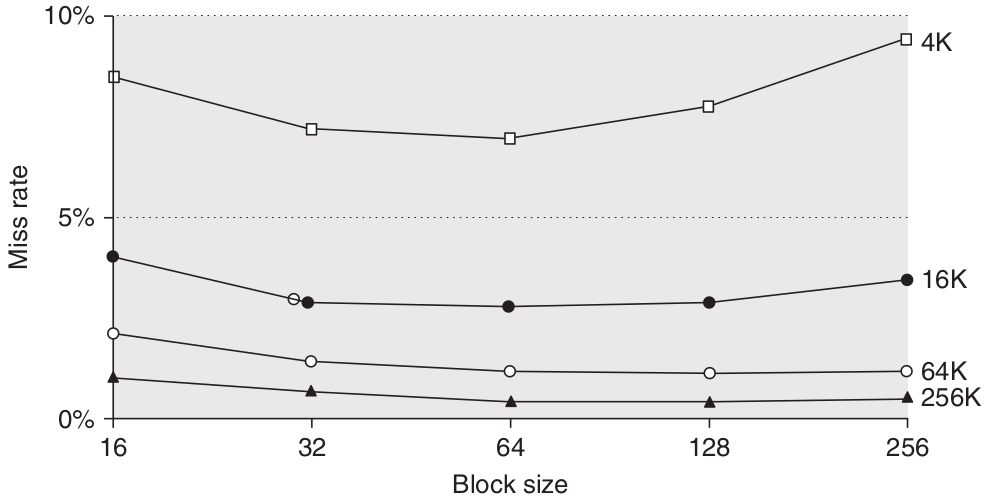

**\textcolor{blue}{Risposta}**: Il modo più semplice per ridurre la frequenza delle *miss* (**miss rate**) è aumentare la dimensione dei blocchi. Attenzione: le caches sfruttano il **principio di località**. In particolare, il principio di località può essere suddiviso in due componenti:

- **Principio di località spaziale**: nell'immediato futuro è molto probabile che il processore acceda a locazioni di memoria che appartengono ad un "intorno" della locazione di memoria appena acceduta.
- **Principio di località temporale**: nell'immediato futuro è molto probabile che il processore acceda nuovamente alla locazione di memoria appena acceduta.

Vediamo in azione questi due principi. Supponiamo di avere la seguente funzione:
```c++
float dot_product(float *a, float *b, int len) {
    float result = 0.0;
    for (int i = 0; i < len; i++) {
	    result += (a[i] * b[i]);
    }
    return result;
}
```
Il *principio di località temporale* entra in gioco quando il processore esegue il ciclo `for`: infatti, ad ogni iterazione accede al blocco di memoria in cui sono contenuto le istruzioni che codificano `result += (a[i] * b[i]);`. Inoltre, lo statement appena citato gode del *principio della località spaziale* visto che accede sequenzialmente agli elementi dei due vettori: all'iterazione $i$ il ciclo accede agli elementi `a[i]` e `b[i]` che, in memoria, si trovano subito dopo gli elementi acceduti all'iterazione precedente, ovvero `a[i-1]` e `b[i-1]`.

Attenzione: essendoci due fenomeni in gioco, gli effetti prodotti dall'aumento della dimensione del blocco non sono sempre quelli desiderati. Come abbiamo già detto, aumentare la dimensione del blocco favorisce la località spaziale. Se aumentiamo la dimensione del blocco fino ad un punto tale che abbiamo pochi blocchi, allora la località temporale è fortemente penalizzata in questa situazione. Il fenomeno appena descritto lo possiamo vedere dall'andamento del miss rate nel caso di una cache di 4KiB. Inoltre, dobbiamo prestare attenzione al fatto che l'aumento della dimensione del blocco provoca l'aumento del *miss penalty* (blocchi più grandi richiedono più tempo per risolvere la miss).


### **\textcolor{red}{Domanda}**: Come possiamo valutare la distribuzione delle miss in riferimento ad un particolare programma, riuscendo ad individuare le cause delle miss?

**\textcolor{blue}{Risposta}**: Esistono tre tipologie di miss:

1. **Compulsory miss** - Questa tipologia di miss si verifica quando un programma viene eseguito per la prima volta (o dopo molto tempo la sua ultima esecuzione). Questa tipologia di miss non può essere risolta del tutto perchè è causa del fatto che l'immagine del programma, all'avvio, non può essere presente in memoria cache. In realtà le compulsory miss possono accadere anche nel contesto di una chiamata a funzione, durante la gestione di un interrupt oppure a seguito di un \texttt{page fault}. La causa, anche nelle situazioni appena descritte, è sempre la stessa: l'immagine del programma (inteso come funzione, interrupt handler, eccetera) non è presente in cache. Possiamo mitigare le compulsory miss aumentando la dimensione del blocco: in questo modo impiegheremo meno accessi alla memoria per caricare l'immagine del programma in esecuzione.

2. **Capacity miss** - Questa tipologia di miss si verifica quando la cache è piena! Come ogni "contenitore", anche la cache ha una capacità finita e, di conseguenza, man mano che il sistema esegue programmi si arriva ad un punto in cui tutte le cache entry sono occupate. Una soluzione, banale, per mitigare questo fenomeno è aumentare la dimensione della cache. Attenzione: avere una cache più grande aumenta l'**hit time** e di conseguenza aumenta il tempo medio di accesso alla memoria[^11].

3. **Conflict miss** - Per spiegare cosa sono le miss di conflitto è necessario ricordarci come funzionano le cache associative. Per semplicità spieghiamo il fenomeno nel caso di una cache ad accesso diretto e poi generalizziamo anche nel caso di una cache a *n* vie. Quando il processore *produce* un indirizzo di memoria, quest'ultimo viene intercettato dal controllore della cache. Il controllore è incaricato di verificare che la word richiesta dal processore sia *già* presente in cache oppure se la word ha generato una miss. Il controllo avviene a partire dall'indirizzo intercettato: una volta calcolato \texttt{address.index} e \texttt{address.tag}, il controllore accede ai campi \texttt{cache[address.index].tag} e \texttt{cache[address.index].v} e verifica se \texttt{address.tag} == \texttt{cache[address.index].tag} \& \texttt{cache[address.index].v} == 1. Se il bit di validità è pari a 1 ma il confronto tra i due tag ha dato esito negativo allora si verifica una \underline{miss di conflitto}.

Ora possiamo rispondere la domanda. Stimare la distribuzione delle miss generate da un programma non è una passeggiata di salute:

- Le compulsory miss possono essere stimate simulando il programma e tenendo conto di tutti quelli accessi in memoria che accedono per la prima volta ad un certo indirizzo. Gli accessi di questa natura produrrano delle compulsory miss perchè l'immagine della memoria riferita dagli indirizzi in questione non è ancora presente in cache.
- Le miss di capacità possono essere stimate simulando l'esecuzione di un programma in un sistema avente un cache *fully associative*. Oltre alle compulsory miss, le cache fully associative, per loro natura, possono produrre solo miss di capacità visto che un blocco di memoria può essere mappato in un blocco qualsiasi della cache.
- Le miss di conflitto possono essere stimate eseguendo il programma su un sistema avente una *n-ways set associative* cache e saranno date dalla differenza tra le miss totali osservate e le miss totali osservate quando si è fatto girare il programma su un sistema avente una cache *fully associative*.

[^11]: Il tempo medio d'accesso alla memoria è dato da $\texttt{AVG\_access\_time} = \texttt{hit\_time} + \texttt{miss\_penalty} \times \texttt{miss\_rate}$.


### **\textcolor{red}{Domanda}**: Come possiamo migliorare le prestazione della cache?

**\textcolor{blue}{Risposta}**: La formula del tempo medio di accesso alla memoria ci fornisce un quadro per presentare le ottimizzazioni rivolte a migliorare le prestazioni della cache.

\begin{center}
$\texttt{AVG\_access\_time} = \texttt{hit\_time} + \texttt{miss\_penalty} \times \texttt{miss\_rate}$
\end{center}

**Aumentare la dimensione del blocco** - La soluzione più semplice per ridurre il **miss rate** è aumentare la dimensione dei blocchi. All'aumentare della dimensione del blocco diminuiscono le compulsory misses. Tale diminuzione avviene perché il principio della località ha due componenti: la \underline{località temporale} e la \underline{località spaziale}. Blocchi più grandi sfruttano la località spaziale.
Tuttavia, all'aumentare della dimensione dei blocchi, aumenta il prezzo da pagare per risolvere una miss (**miss penalty**). Inoltre, poiché all'aumentare della dimensione dei blocchi il numero di blocchi diminuisce, potrebbero aumentare le miss di conflitto e persino le miss di capacità (se la cache è di dimensioni ridotte). Pertanto, non vi è motivo di aumentare la dimensione dei blocchi a un punto tale da aumentare il miss rate: non c'è alcun beneficio nel ridurre il miss rate se ciò comporta un aumento del tempo medio di accesso alla memoria. Potrebbe anche accadere che i benefici dati dall'aumento della dimensione del blocco (che si traduce in una diminuzione del miss rate) potrebbero essere oscurati dall'aumento del miss penalty.

**Aumentare la dimensione della cache** - Il modo ovvio per ridurre le miss di capacità è aumentare la capacità della cache. Lo svantaggio evidente è il potenziale aumento del tempo di hit e dei costi e/o del consumo di energia. Questa tecnica è stata particolarmente popolare nelle cache esterne (off-chip).

**Aumentare il grado di associatività** - Lo scopo delle *cache set-associative* è proprio quello di \underline{ridurre le miss di conflitto} rispetto al caso di una *cache direct-mapped*. Vediamo quali sono i benefici portati dall'aumento del numero di blocchi per set. Supponiamo di avere il seguente codice:
```c++
    for (int i = 0; i < n; i++) {
	    P1();
	    ...
	    P2();
    }
```
Supponiamo inoltre che le funzioni `P1()` e `P2()` siano disposte in memoria come rappresentato in Figura \ref{fig:conflict_misses}.

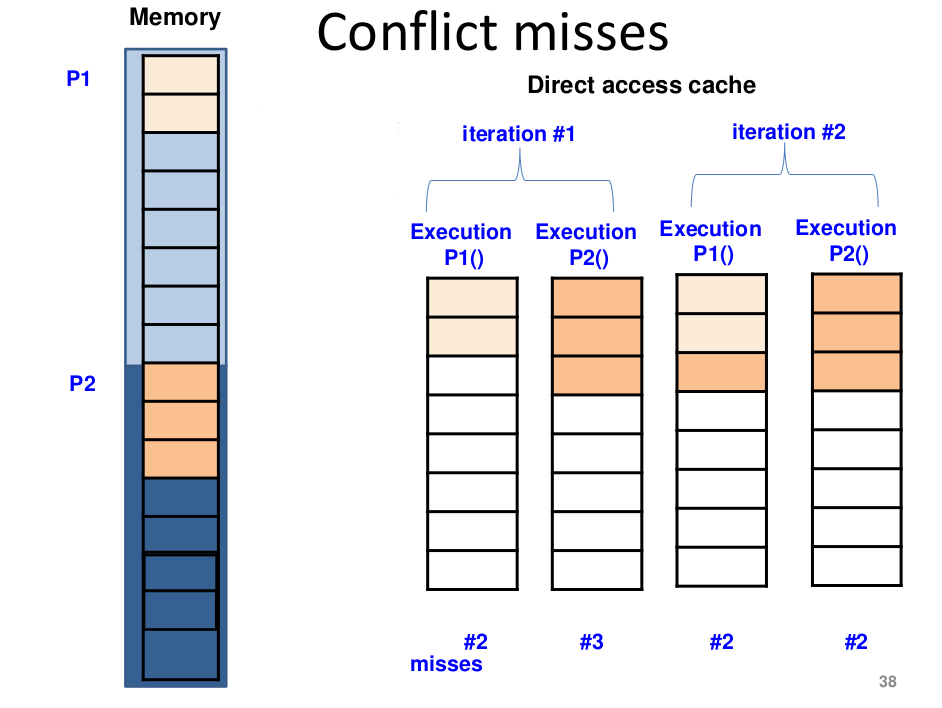

La disposizione in memoria delle due funzioni fa si che ad ogni iterazione del ciclo `for` la funzione `P2()` prende il posto, in cache, della funzione `P1()`. In pratica, il layout delle funzioni in memoria fa si che ad ogni iterazione si rimpiazzano sempre 2 blochi $\rightarrow$ 4 conflict misses (fatta eccezione della prima iterazione nel quale avvengono 5 misses, le prime 2 sono compulsory misses, le seconde 2 sono conflict misses e l'ultima è ancora una compulsory miss).

Ma se avessimo un'ulteriore blocco per ogni cacheline? Beh, avremo risolto il problema. Ecco dove entrano in gioco le set-associative caches (Figura \ref{fig:conflict_misses_resolved}).

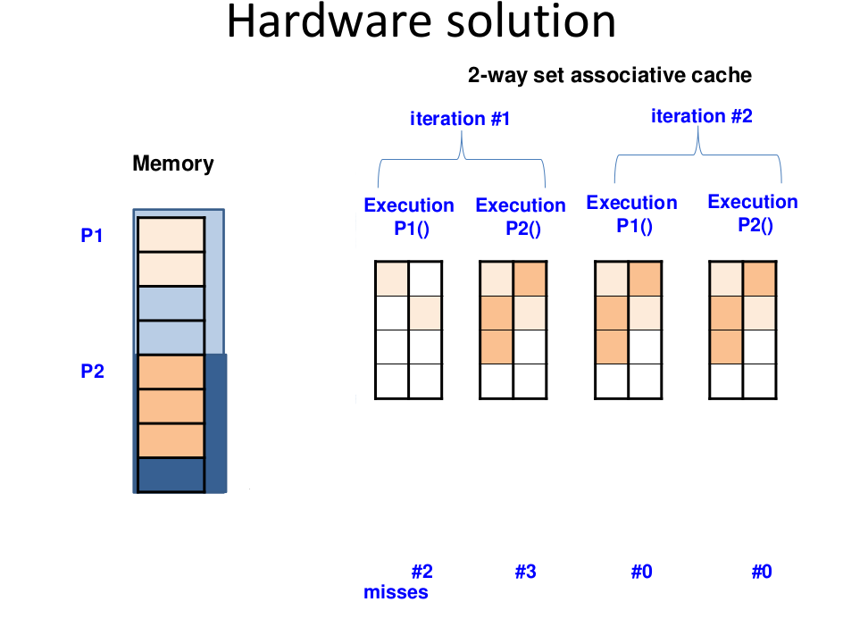

**Dare priorità alle** \texttt{read misses} **rispetto alle** \texttt{writes} - Questa ottimizazzione permette di ridurre il *miss penalty* sperimentato dalle read misses. In particolare, questa ottimizzazione può essere implementata mediante l'utilizzo di un **write buffer**. Un write buffer non è altro che un buffer d'appoggio nel quale vengono posizionati tutti i blocchi oggetto di un operazione di scrittura. Dal punto di visto della cache, la scrittura termina quando il blocco è stato allocato nel write buffer. In seguito, il controllore della cache si occuperà di propagare le scritture dal write buffer in memoria quando, ad esempio, non ha altre richieste provenienti dal processore da servire. Sia nel caso di una cache \texttt{write-through} sia nel caso di una cache \texttt{write-back}, il write buffer può essere utilizzato come un "estensione della cache": in seguito ad una read miss, il controllore cache deve verificare che il blocco richiesto sia presente nel write buffer. Se fosse presente, oltre ad avere prelevato il blocco aggiornato[^15], la read miss è stata risolta in meno tempo perchè il write buffer si trova molto più vicino rispetto al livello superiore di cache!

[^15]: Se un blocco di memoria è nel write buffer significa che la scrittura in memoria principale non è stata ancora effettuata e di conseguenza la memoria principale non è allineata al valore corretto.

### **\textcolor{red}{Domanda}**: Come sono gestite le scritture dalla cache? \label{answer:what_happens_on_a_write}

**\textcolor{blue}{Risposta}**: Le operazioni necessarie a soddisfare un operazione di write sono ben diverse da quelle necessarie a soddisfare un operazione di read. La \underline{write} è un \underline{operazione distruttiva}, una read non lo è. Supponiamo che nel mentre il controllore della cache determina se l’indirizzo intercettato ha generato una hit o una miss, l’operazione richiesta dal processore viene eseguita sul blocco di memoria acceduto. In altre parole, l'operazione ed il controllo dell'evento hit/miss avvengono in parallelo. Se l’operazione fosse una *read*, alla peggio, i dati letti dal processore vengono ignorati con, ovviamente, uno spreco di energia ma senza alcuna conseguenza distruttiva. Se l’operazione fosse una *write*, nel caso in cui l’indirizzo abbia generato una miss, la scrittura avrebbe sovrascritto un blocco non interessato dall’operazione. Per questo motivo una **\underline{write deve essere eseguita solo dopo che il controllore cache} \underline{abbia decretato hit o miss}**.

Una volta decretato che il blocco di memoria puntato dall’indirizzo si trova in memoria cache (hit), dobbiamo decidere su quali blocchi di memoria compiere la scrittura. Si, abbiamo utilizzato il plurale perché ora le informazioni presenti su un blocco di memoria principale possono essere presenti in più copie che risiedono sui vari livelli della gerarchia di memorie cache. Quale blocco di memoria sovrascriviamo? Il blocco di memoria cache? Il blocco di memoria principale? Entrambi? La risposta a queste domande è data dalla politica di gestione delle write:

- **Write-through** – Le informazioni sono scritte sia nel blocco di memoria cache sia nei blocchi di memoria dei livelli successivi in cui è presente l'informazione.

- **Write-back** – Le informazioni sono scritte solo nel blocco di memoria cache. Le modifiche saranno propagate solo quando il blocco di memoria cache sarà rimpiazzato. Questo meccanismo necessita di ricordarsi quali blocchi di memoria devono essere aggiornati nel momento in cui devono essere rimpiazzate le cacheline associate: al momento del rimpiazzamento, il controllore della cache legge il bit \texttt{dirty} e aggiorna il blocco di memoria se il bit \texttt{dirty} $==$ 1.

La politica write-through è poco performante: ad ogni scrittura si deve accedere comunque alla memoria principale. D’altro canto la politica write-through è *poco costosa* da implementare e permette una \underline{gestione della coerenza tra cache molto più semplice} in presenza di multiprocessori (studieremo questo argomento in futuro).

La politica write-back permette di compiere le operazioni di scrittura alla velocità della memoria cache che intercetta l’indirizzo. Facciamo un esempio per capire meglio:

- Supponiamo che il contatore utilizzato in un ciclo `for` risieda nella cache dati L1 e che non venga mai rimpiazzato. 
- Ad ogni iterazione del `for` quest’ultimo viene incrementato (operazione di scrittura).
- Ogni incremento avviene alla velocità della memoria cache L1 e non alla velicità della memoria principale $\: \rightarrow \:$ incremento delle perfomance visto che si è diminuito la latenza causata dall’incremento del contatore.

Inoltre, la politica write-back occupa meno il bus perché molte operazioni di scrittura non vengono propagate fino alla memoria principale (fino a quando il blocco di memoria in questione deve essere rimpiazzato), rendendola attraente agli occhi dei multiprocessori.

Ed in caso di write miss? Anche qui esistono due politiche:

- **Write allocate** – In caso di miss il blocco di memoria puntato dall’indirizzo viene allocato in cache e si compiono le operazioni previste dalla politica in caso di hit.
- **No-Write allocate** – In caso di miss il blocco di memoria puntato dall’indirizzo viene aggiornato nel livello della gerarchia su cui risiede ma non allocato in cache.


### **\textcolor{red}{Domanda}**: Come sono gestite le cache miss da un processore pipelined?

**\textcolor{blue}{Risposta}**: Se parliamo di una pipeline statica, la gestione di una cache miss è del tutto uguale alla gestione di un hazard:

1. La pipeline stalla.
2. Viene risolta la miss (prelievo del blocco di memoria dal livello superiore della gerarchia di cache).
3. Quando il blocco è diventato disponibile, la pipeline:
    - Ripete il ciclo di fetch se la miss è stata causata da un istruzione.
    - Completa l'accesso in memoria se la miss è stata causata da un operando in memoria.

### **\textcolor{red}{Domanda}**: Critical word first e early restart. Cosa sono e come funzionano.

**\textcolor{blue}{Risposta}**: In caso di cache miss, il processore deve attendere fino a quando un intero blocco nella cache viene sostituito dalla memoria principale. Tuttavia, i dati effettivamente richiesti dal processore non saranno l'intero blocco, ma una (o più) \texttt{word} all'interno di questo blocco. Pertanto, anziché attendere che l'intero blocco venga caricato, il processore può riprendere la sua operazione non appena le \texttt{word} necessarie sono disponibili.

- **Early restart**: In questa ottimizzazione, le \texttt{word} nel blocco vengono recuperate nell'ordine normale (in sequenza). Tuttavia, non appena la \texttt{word} richiesta arriva, viene inviata al processore. Il processore continua ora l'esecuzione. Questo meccanismo è chiamato "early restart" perché il processore riprende l'esecuzione prima che l'intero blocco di cache sia caricato.

- **Critical word first**: La \texttt{word} che il processore necessita è etichettata come "\texttt{word} critica". Questa \texttt{word} critica viene recuperata per prima dalla memoria e inviata al processore. Il processore continua ora l'esecuzione. Il resto delle \texttt{word}s mancanti viene poi recuperato nell'ordine normale (in sequenza).


### **\textcolor{red}{Domanda}**: Come funziona la cache in presenza di indirizzi virtuali?

**\textcolor{blue}{Risposta}**: Cache e TLB possono essere disposti in diversi ordini e di conseguenza possono generare diversi pattern d'acceso alla memoria. Vediamo quali possono essere:

1. **Physically Indexed Physically Tagged**: L'indirizzo virtuale generato dalla CPU prima viene intercettato dal TLB (quidi tradotto da virtuale a fisico) e poi dalla cache.

2. **Virtually Indexed Virtually Tagged**: L'indirizzo virtuale generato dalla CPU prima viene intercettato dalla cache (quindi il campo tag viene calcolato sull'indirizzo virtuale) e poi, l'indirizzo ha generato una miss, l'accesso in memoria viene supportato dalla traduzione dell'indirizzo compiuta dal TLB. Questo approccio presenta due problemi:
    - Context switch. Ogni volta che il sistema operativo esegue un cambio di contesto (e quindi avviene anche un cambio della tabella di traduzione) si deve fare il flush della cache L1 perchè indirizzi virtuali prodotti dal processo entrante mappano in indirizzi fisici diversi dal processo uscente.
    - Aliasing. Due processi possono condividere la stessa pagina di memoria fisica anche se si riferiscono alla pagina fisica con indirizzi virtuali diversi. Questo fenomeno potrebbe causare delle incosistenze: se due processi condividono una blocco di memoria e quest'ultimo è presente in cache su due blocchi diversi (verosimilmente lo stesso blocco fisico è mappato su indirizzi virtuali diversi), se un processo scrive sul blocco condiviso allora nasce un problema di incosistenza visto che l'altro processo non vede la modifica. Per risolvere questo problema serve della logica aggiuntiva che aumenterebbe la complessità della cache L1 (e di conseguenza aumenterebbe l'hit time).


### **\textcolor{red}{Domanda}**: Flusso di coscienza sulla cache.

**\textcolor{blue}{Risposta}**: La cache è un componente hardware (il cui operato è \underline{invisibile} agli occhi dei programmi) utilizzato per diminuire la latenza d'accesso alla memoria principale. In particolare, nei moderni processori si utilizza una gerarchia multilivello di memorie avente lo scopo di minimizzare il tempo speso dal processore in attesa del completamento di un'operazione (lettura/scrittura) sulla memoria. I primi livelli di questa gerarchia sono occupati dalla cache.

**Esempio** - Vediamo l'impatto, sul tempo di esecuzione di un programma, del tempo impiegato dalle operazioni sulla memoria. In particolare, prendiamo in esame il \texttt{CPU execution time}, ovvero il tempo che il programma spende in *esecuzione* (quindi escludiammo tutto il tempo introdotto dall'overhead dello scheduling, migrazione, sospensioni, ecc.):
\begin{center}
    \texttt{CPU exec time} = (\texttt{CPU clock cycles} + \texttt{Memory stall cycles}) $\times$ \texttt{CPU cycle time}
\end{center}
L' odierna tecnologia con il quale è implementata la memoria principale (DRAM) richiede un tempo d'accesso nell'ordine dei \texttt{100} nanosecondi (dai \texttt{50} ai \texttt{150} nanosecondi) mentre un moderno processore lavora con un periodo di clock nell'ordine dei \texttt{0.1} nanosecondi: la differenza tra la "velocità" del processore e la "velocità" della memoria è **enorme**. \newline
La conseguenza della differenza di velocità si manifesta nel tempo di esecuzione di un programma: i \texttt{memory stall cycles} saranno di diversi ordini di grandezza più grandi rispetto ai \texttt{CPU clock cycles}! Prendiamo in esame un processore pipelined il cui clock rate è 2.5 GHz e \texttt{CPI} = 1: per ogni istruzione che accede alla memoria, la CPU è costretta ad aspettare \texttt{memory stall cycles} = $\frac{\texttt{memory access time}}{\texttt{clock period}} = \frac{100}{0.4} = 250$ ed il rapporto tra \texttt{instruction cycles} e \texttt{memory stall cycles} è \texttt{1} : \texttt{250}. Affinchè si possano migliorare le perfomance (tempo di esecuzione) dei nostri programmi vorremo diminuire il gap tra la CPU e la memoria principale.

Ora che abbiamo capito quale strada intraprendere (avere delle memorie "veloci") dobbiamo capire come raggiungere la nostra meta. In realtà esiste già un tecnologia di memorizzazione "veloce": SRAM. Il problema della tecnologia SRAM è il costo. Quindi, il nostro obiettivo è il seguente: vogliamo avere una memoria grande e poco costosa ma allo stesso tempo veloce e quindi in grado di minimizzare il gap con la CPU. L'obiettivo appena presentato può essere raggiunto introducendo una gerarchia di memorie! \newline
Vorremo che il primo livello della gerarchia (ovvero il livello più vicino alla CPU) sia il più veloce possibile in modo tale che tutte le operazioni sulla memoria richieste dalla CPU siano risolte nel minor tempo possibile. Tale livello dovrà, dunque, essere implementato mediante la tecnologia SRAM. Putroppo, visti gli elevati costi della tecnologia SRAM, non possiamo avere una memoria la cui dimensione sia in grado di rimpiazzare definitavamente il ruolo della memoria principale. L'idea chiave che risolvere quest'ultimo problema è la seguente: vorremo avere una memoria "piccola" e veloce nel quale portare i dati strettamente necessari per l'esecuzione del programma e affiancare a tale memoria delle altre memorie meno veloci (ma comunque più veloci della memoria principale) di dimensioni maggiori in grado di contenere i dati che il livello precedente non è in grado di contenere.

Il meccanismo che abbiamo appena presentato funziona solamente se i nostri programmi rispettano un qualche **principio di località**. Di fatto, ogni livello della gerarchia di memoria è in grado di contenere un sottoinsieme dello spazio di memoria. Se i programmi "saltassero" da un indirizzo appartenente al sottoinsieme caricato in memoria cache ad un altro indirizzo appartenente ad un altro sottoinsieme con una frequenza alta allora la CPU sarebbe costretta ad attendere molto spesso che la cache recuperi il nuovo sottoinsieme di memoria appena acceduto dal programma.

Fortunatamente i programmi godono di due tipologie di località:

- **Principio di località temporale**: è molto probabile che, in un futuro prossimo, il programma in esecuzione acceda nuovamente alla locazione di memoria appena acceduta.

- **Principio di località spaziale**: è molto probabile che, in un futuro prossimo, il programma in esecuzione acceda a locazioni di memoria appartenenti ad un intorno alla locazione di memoria appena acceduta.

Ora la domanda sorge spontanea: **come funziona la cache**? La cache è una memoria: l'organizzazione e il funzionamento di una cache è del tutto uguale a ciò che abbiamo già visto sulla memoria principale. Così come ogni locazione della memoria principale può essere acceduta mediante indirizzo, anche le locazioni della cache possono essere accedute in maniera del tutto simile. L'unica differenza tra la memoria principale e la cache è risiede nel concetto che attribuiamo a "locazione di memoria":

- In memoria principale, \underline{una locazione di memoria è l'unità di memorizzazione}. Ogni operazione di memorizzazione può avvenire con una granularità minima dettata dalla dimensione della locazione di memoria.

- In cache, \underline{una locazione di memoria è un insieme di unità di memorizzazione}. Di fatto, per sfruttare i principi di località[^17], le cache utilizzano come unità di memorizzazione non più una locazione di memoria (quindi una \texttt{word}, \texttt{double word}, ecc.) ma un insieme di quest'ultime. Ci riferiamo all'unità di memorizzazione utilizzata dalla cache con i termini **blocco**, **cacheline** o semplicemente **line**. Di conseguenza, l'accesso in memoria cache avviene al blocco.

[^17]: In particolare il principio di località spaziale.

Inoltre, la memoria cache è un **sottoinsieme** della memoria principale: è possibile che il processore voglia accedere ad una locazione di memoria non presente in memoria cache! Per questo motivo abbiamo bisogno di un po' di logica aggiuntiva. Tale logica è implementata dal **controllore cache**. \newline
Il controllore intercetta tutte le operazioni di lettura e scrittura nello spazio di memoria eseguite dal processore. Per ogni operazione controlla prima se il dato a cui il processore vuole accedere si trova in memoria cache, nel qual caso l’accesso può essere completato velocemente; altrimenti esegue l’operazione in memoria al posto del processore e mantiene una copia del dato in cache (in quanto si spera che il processore lo chiederà di nuovo, per il principio di località temporale). All’inizio la memoria cache non conterrà niente ma, a poco a poco, si riempirà con le locazioni a cui il programma sta accedendo. Se la memoria cache si riempie, il controllore dovrà decidere quali locazioni tenere e quali eliminare (**rimpiazzare**), sempre cercando di mantenere quelle che è più probabile che vengano richieste in seguito. Si noti che né il controllore cache, né il processore conoscono le locazioni che verranno richieste in futuro: il controllore vede solo le operazioni che il processore genera e il processore vede una sola istruzione per volta. Le decisioni del controllore sono dunque \underline{euristiche}.

\texttt{[*1*]} **\textcolor{red}{In quale blocco di memoria cache può essere memorizzato un blocco di memoria?}** Esistono 3 approcci differenti:

1. In una cache **direct mapped** ogni blocco della memoria principale viene mappato in esattamente un blocco nella cache. Il mapping viene generalmente determinato prendendo l'indirizzo del blocco e eseguendo un'operazione di modulo con il numero di blocchi nella cache. In particolare
\begin{center}
    (Indirizzo del blocco) \texttt{MOD} (Numero di blocchi nella cache)
\end{center}
2. Se un blocco di memoria può essere posizionato ovunque nella cache, si dice che la cache sia **fully associative**. 
3. Se un blocco può essere posizionato in un insieme limitato di blocchi nella cache, la cache è detta **set associative**. Un insieme (**set**) in questo contesto si riferisce a un gruppo di blocchi nella cache. Il blocco di memoria viene inizialmente mappato in un set specifico e poi può essere posizionato in qualsiasi blocco di cache all'interno di tale set. Il set viene tipicamente determinato utilizzando la seguente formula:
\begin{center}
(Indirizzo del blocco) \texttt{MOD} (Numero di insiemi nella cache)
\end{center}
Se ci sono \texttt{n} blocchi in ogni set, la cache è detta **n**-**way set associative**.

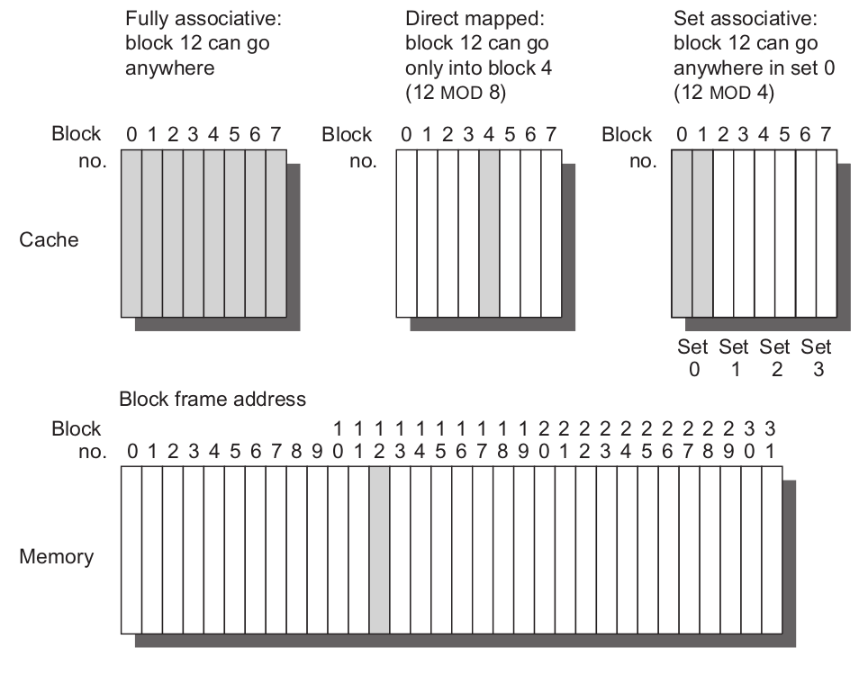

\texttt{[*2*]} **\textcolor{red}{Come viene trovata una locazione di memoria se quest'ultima è presente nella cache?}** Nelle cache direct mapped o set associative si accede al blocco di memoria cache o al set in funzione dell'indice. Tale indice viene calcolato a partire dall'indirizzo di memoria prodotto dal processore. Una volta acceduti al blocco di memoria cache, è necessario accertarsi che il blocco (set) acceduto contiene la locazione di memoria richiesta dal processore. Le cache hanno un **tag** su ogni blocco di cache che fornisce l'indirizzo (di memoria principale) del blocco. In una cache direct mapped, il controllore cache confronta il tag del blocco che potrebbe contenere le informazioni desiderate per verificare se corrisponde all'indirizzo proveniente dal processore. In una cache set associative, tutti i possibili tag vengono confrontati in parallelo per minimizzare il tempo d'accesso (**hit time**). \newline
Deve esserci un modo per sapere se un blocco della cache contiene informazioni valide o meno. La procedura più comune consiste nell'aggiungere un bit di validità ad ogni tag per indicare se questa voce contiene un indirizzo valido. Se il bit non è settato, non può esserci una corrispondenza con questo indirizzo. \newline
La Figura \ref{fig:cache_address} mostra come viene diviso un indirizo. La prima divisione avviene tra l'indirizzo del blocco (o indirizzo del set nel caso set associative) e l'offset del blocco. L'indirizzo del blocco può essere ulteriormente diviso nel campo tag e nel campo indice. Il campo offset seleziona i dati desiderati all'interno blocco, il campo indice seleziona il blocco (o il set nel caso set associative). Infine, il campo tag viene confrontato per determinare se c'è una **hit**.


\texttt{[*3*]} **\textcolor{red}{Quale blocco dovrebbe essere rimpiazzato in caso di cache miss?}** Quando si verifica una miss, il controllore cache deve selezionare un blocco da *rimpiazzare* con i dati desiderati. Un vantaggio delle cache direct mapped è che le decisioni hardware sono semplificate, in realtà così semplici che non c'è scelta: solo un blocco viene controllato per un hit e solo quel blocco può essere sostituito. Con le cache fully associative o set associative, ci sono molti blocchi tra cui scegliere in caso di miss. Esistono tre strategie principali utilizzate per selezionare quale blocco sostituire: 

1. **Random**: per distribuire uniformemente l'allocazione, vengono selezionati casualmente i blocchi da rimpiazzare.

2. **LRU**: per ridurre la probabilità di eliminare informazioni che saranno preso riutilizzate, gli accessi ai blocchi vengono registrati. Affidandosi al passato per prevedere il futuro, il blocco sostituito è quello che è stato inutilizzato per il periodo più lungo. LRU si basa su un corollario della località: se i blocchi utilizzati di recente sono probabilmente destinati ad essere utilizzati nuovamente, allora un buon candidato per la sostituzione è il blocco meno recentemente utilizzato.

3. **FIFO**: poiché LRU può essere complicato da calcolare, questa strategia approssima LRU determinando il blocco più vecchio anziché il meno recentemente utilizzato.


\texttt{[*4*]} **\textcolor{red}{Cosa succede durante un'operazione di scrittura?}** Vedi Risposta \ref{answer:what_happens_on_a_write}.
