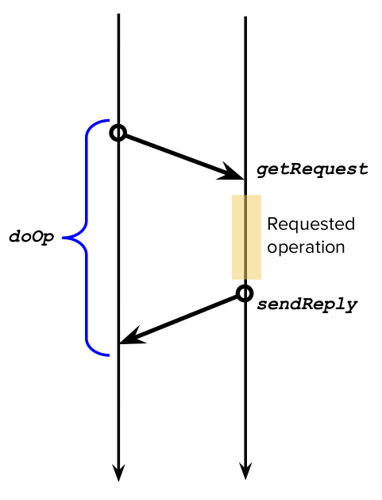

   Communication Support for Distributed Systems
==================================================

## Direct Communication
In direct communication we will try to address increasingly abstract ways to provide direct communication: 

 1. We’ll start with `request/reply` protocols.
 2. Remote Procedure Call (RPC), that provides remote execution of code on the basis of explicit requests, even between very heterogeneous nodes.
 3. Remote Method Invocation, where everything is discussed in an object-oriented environment.

### Request/Reply Protocols
Request/reply protocols are a type of direct communication protocols based on a synchronous communication: client waits for a reply. Such protocols provide 3 primitives.

> `public byte[] doOp(RemoteRef s, int opId, byte[] arguments)` => The primitive `doOp` method is designed to be used by clients requesting a resource or computation. The client needs to know how to "contact" the server that will fulfill its request. A server can provide various services. To determine which service the client needs, the client specifies the requested service using a unique identifier (`opId`). Additionally, many services can produce "custom results" based on a list of arguments. When the client requests a service, it sends the required parameters.

There is a problem: arguments passing cannot be handled by the paradigm we are accustomed to, i.e., arguments passed by reference or arguments passed by copy. Both client and server needs to agree on how to encode the exchanged data. Transforming the arguments that will be passed into a data structure that can be transmitted over the network is called **marshalling** (and **un-marshalling** the opposite operation). 

> `public byte[] getRequest()` => The primitive `getRequest()` is used by servers to wait for incoming requests. The primitive is blocking: the server waits, idle, until a new request arrives.  

> `public void sendReply(RemoteRef c, byte[] reply)` => Sends the reply message to the client `c`, possibly with the result of the requested operation.

    
    <label for="img">Sequence of primitive invocations in a request/reply protocol</>

What about the failure model adopted by request/reply protocols? The failure model addresses potential issues that may arise during the execution of the mentioned operations. Working with a UDP-like model introduces the possibility of message loss and the absence of guaranteed message order. In adopting a fail-stop model for processes, we assume a process is dead if it cannot be found.

To identify if a server is down, we implement a timeout in the `doOp` function. If no reply is received within a specified timeout, we consider the server to be unavailable. After a timeout, we assume we will never receive a reply and may request retransmission. 

In the event of retransmission, the server may receive the same request multiple times, leading to potential duplicates with the same `requestId`. In such cases, we implement duplicate filtering, discarding duplicates of already received messages.

Additional considerations involve re-execution and caching on the server side. If a received request corresponds to a previously calculated value, we can choose to re-execute the corresponding code to recalculate the value or use the cached result as a reply for the client. It's important to note that caching is applicable only to idempotent requests, where the idempotency of a function means it consistently returns the same result when called twice with the same argument.

## Remote Procedure Call (RPC
Remote Procedure Call (RPC) serves as a means of communication between processes, potentially residing on different nodes. RPC is based on the request/reply paradigm that we encountered before: the request assumes the shape of a remote procedure call and the reply is the associated result produced by the procedure.

