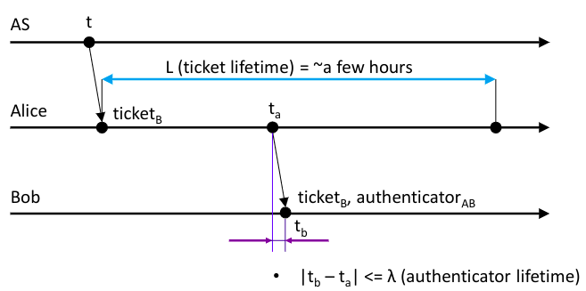
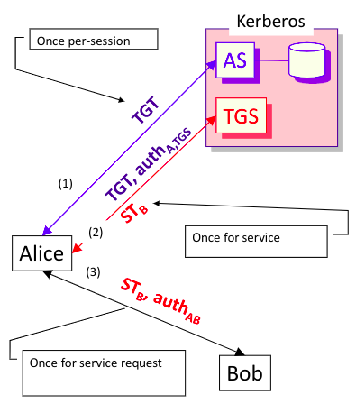

# Kerberos

Kerberos is an authentication system. The protocol is based on the Needham-Schroeder protocol. The underlying architecture is the following:

1. There are three actors: a Client A, an Authentication Server, $\mathsf{AS}$, and service Server B (for the sake of brevity, we will call the latter just Server).

2. The Client A shares a symmetric secret key with the Authentication Server ($\mathsf{K_{A}}$). Also, the Server B shares with $\mathsf{AS}$ a symmetric secret key ($\mathsf{K_{B}}$).

The primary objective of the protocol is to provide authentication of the Client. Once the Client has been authenticated by the Authentication Server, the secondary objective is to establish a session key shared between the Client and the Server.

## The simplified protocol 

A simplified version of the authentication protocol could be described as follows:

```
			AS                    Client A                Server B
			|                        |                       |
			|  <----credentials----  |                       |
			|  -------YES/NO------>  |                       |
			|                        |                       |
			|                        |                       |
			|  <------request------  |                       |
			|                        |                       |
			|  --------TA,ST------>  |                       |
			|                        |                       |
			|                        |  ------ST,auth----->  |
			|                        |                       |
			|                        |  <-------auth-------  |
```

1. The Kerberos protocol initiates with the Client authenticating itself to the Authentication Server ($\mathsf{AS}$). During the setup phase, the user authenticates by entering their username and password, resulting in the derivation of a symmetric key, $\mathsf{K_{A}}$, from the user's password.

2. The protocol continues when the Client A needs to "talk" with the Server B. The first message is produced by Client A directed to the Authentication Server. The message is structured as follows:

	> $\mathsf{A}$ $\mathsf{\longrightarrow}$ $\mathsf{AS}$ : $\mathsf{A}$, $\mathsf{B}$, $\mathsf{t}$, $\mathsf{L}$, $\mathsf{N_{a}}$, $\mathsf{WS}$

	Message M1 is a sort of request message: it embeds the Client's id as well as the Server's id, i.e., the Server which Client $\mathsf{A}$ wants to talk with. Since Kerberos was thought for a local scenario, as a measure of message's freshness, the protocol uses timestamp (field $\mathsf{t}$). Another security measure imposed by the protocol is that an authenticated user is linked together with the computer he/she is using: $\mathsf{WS}$ is a unique id that represents the current machine on which the Client is accessing the system. If the Client requires a service but he/she access the system from a different host, then he/she will be rejected (preventing adversaries from impersonating a Client who is accessing the system from a different host).

3. Kerberos is based on **ticket**s: upon AS receives message M1, an authentication ticket $\mathsf{TA}$ and a service ticket $\mathsf{ST}$. Then, Authentication Server sends message M2:

	> $\mathsf{AS}$ $\mathsf{\longrightarrow}$ $\mathsf{A}$ : $\mathsf{TA = \{ B, t,L, N_{a}, K_{AB} \}_{K_{A}}}$ , $\mathsf{ST = \{ A, B, t, L, K_{AB}, WS \}_{K_{B}}}$ 

	There is one aspect to be discussed: $\mathsf{L}$, that is the validity interval of the ticket. Client $\mathsf{A}$ reuses the ticket for multiple authentications to Server $\mathsf{B}$ without interacting with $\mathsf{AS}$ so avoiding messages M1 and M2.

4. The Client forwards the service ticket $\mathsf{ST}$ and an authenticator ticket to Server B:

	> $\mathsf{A}$ $\mathsf{\longrightarrow}$ $\mathsf{B}$ : $\mathsf{ST = \{ A, B, t, L, K_{AB}, WS \}_{K_{B}}}$, $\mathsf{auth = \{ A, t_{A}, subkey_{AB} \}_{K_{AB}}}$ 

5. Server B replies with an authenticator ticket:

	> $\mathsf{A}$ $\mathsf{\longrightarrow}$ $\mathsf{B}$ :  $\mathsf{auth = \{ t_{A}, subkey_{AB} \}_{K_{AB}}}$ 

So, let's analyze the protocol:

1. The setup phase, during which the user authenticates in the system, only requires the user to enter their username and password. Typing the password once is considered sufficiently secure for typical scenarios such as universities or companies, for which Kerberos was designed.

2. Upon receiving message M2, Client A can determine that the session key between itself and Server B is $\mathsf{K_{AB}}$ (key authentication property). It decrypts the authentication ticket $\mathsf{TA}$ to obtain $\mathsf{K_{AB}}$, checks the integrity of the message by verifying the timestamp $\mathsf{t}$, as Client A is authoritative regarding timestamp $\mathsf{t}$.

3. Message M3 allows Server B to trust that the session key is $\mathsf{K_{AB}}$, as it decrypts the service ticket with $\mathsf{K_{B}}$ and it founds $\mathsf{K_{AB}}$, and to believe that Client A possesses $\mathsf{K_{AB}}$, as it decrypts the authenticator ticket.

4. Client A achieves key confirmation when it successfully decrypts message M4.

<div style="text-align:center;">
    
	<br>
    <label for="img">Lifetime of a service ticket.</label>
</div>


## Complete Architecture of Kerberos

The simplified protocol that we've encountered before, clients need to re-run the protocol each time the user would like to access to a service present in the system: for each run of the protocol, the user obtain a service ticket which is valid for a limited period of time. 

A possible solution for the problem presented above could be to cache passwords for a long period, preventing the user to re-type the password for each service he/she would like to use. Obviously, the latter approach is very little secure.

So, before we start discussing about TGT, i.e., the possible solution of the problem, I would like to cite a very brilliant mind of the last century:

> "*Every problem in computer science can be solved by adding  a level of indirection*“ – D. Wheelar

Let's analyze the protocol:

1. Client A interacts with AS and receives a $\mathsf{TGT}$, ticket granting ticket, a ticket for server TGS.

2. Client A uses $\mathsf{TGT}$ to request $\mathsf{TGS}$ a service ticket $\mathsf{ST_{B}}$ to interact with Server B.

3. Client A uses $\mathsf{ST_{B}}$ to authenticate and to get authenticated to Server B.


<div style="text-align:center;">
    
	<br>
    <label for="img">Ticket Granting Service (TGS) and Ticket Granting Ticket (TGT).</label>
</div>


# Delegation

Within a "system", services can be used by users. Sometimes these services need to contact others, on behalf of the user, like a mail server might need to contact a file server. In order to allow a service to access another service on behalf of the user, a solution has been implemented to meet this need : Kerberos Delegation.

Kerberos provides two mechanisms to implement delegation:

1. Proxy tickets.

2. Forwardable TGT.
