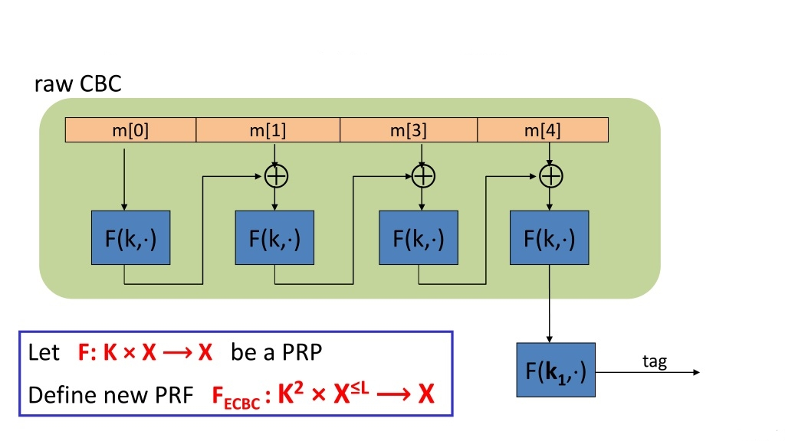

# Message Authentication Codes (MAC)

## Introduction
Similar to digital signatures, MACs append an authentication tag to a message. The crucial difference between MACs and digital signatures is that MACs use a symmetric key $\mathsf{k}$ for both generating the authentication tag and  verifying it. A MAC is a function of the symmetric key $\mathsf{k}$ and the message $\mathsf{x}$.

A formal definition of MAC authentication scheme can be the following:

A Message Authentication Code scheme is a cryptographic primitive defined over three sets {K, M, T}, where:

1. K is the key-space;

2. M is the message space, i.e., $\mathsf{\{0,1\}^{*}}$.

3. T is the tag space, i.e., $\mathsf{\{0,1\}^{t}}$.

A MAC scheme defines a triple of algorithms \{Gen, MAC, Vrfy\}:

1. $\mathsf{Gen: K \rightarrow \{0,1\}^n}$. Gen is a efficient key generation algorithm. 

2. $\mathsf{Gen: K \times M \rightarrow \{0,1\}^t}$. MAC is a efficient algorithm that, given as input a key and message of any size, it produces an authenticated tag. 

3. $\mathsf{Gen: K \times M \times T \rightarrow \{True, \text{ } False\}}$. Ver is a efficient algorithm that, given as input a key, a received message and its tag, it verifies if the received message (or its tag) has been modified after it was sent by the legitimate communicating party.

**Consistency property**: For all key $\mathsf{k}$ and message $\mathsf{x}$, $\mathsf{Vrfy(k, x, MAC(k, x)) = True}$.

## Properties fo MAC

Properties of MACs:

1. **Cryptographic checksum**. A MAC generates a cryptographically secure authentication tag for a given message.

2. Symmetric MACs are based on secret symmetric keys. The signing and verifying parties must share a secret key.

3. **Arbitrary message size**. MACs accept messages of arbitrary length.

4. **Fixed output length**. MACs generate fixed-size authentication tags.

5. **Message integrity**. MACs provide message integrity: any manipulations of a message during transit will be detected by the receiver.

6. **Message authentication**. The receiving party is assured of the origin of
the message.

7. **No non-repudiation**. Since MACs are based on symmetric principles, they do not provide non-repudiation.

The last point is important to keep in mind: MACs do not provide non-repudiation. Since the two communicating parties share the same key, there is no possibility to prove towards a neutral third party, e.g., a judge, whether a message and its MAC originated from Alice or Bob. Thus, MACs offer no protection in scenarios where either Alice or Bob is dishonest. A symmetric secret key is not tied to a certain person but rather to two parties, and hence a judge cannot distinguish between Alice and Bob in case of a dispute.

## Security properties of MAC

Before presenting what are the property we wished a MAC scheme would have, we need to present the threat model:

1. Consider a scenario on which an attacker is able to authenticate any number of messages on his behalf, i.e., an attacker submits to a legitimate entity a number of messages $\mathsf{x_i}$ ($\mathsf{i = 1, ..., n}$) and the legitimate entity compute their related tags $\mathsf{t_i}$. It is a chosen-message attack.

Under such circumstances, we would have the *computation resistance* property:

> Given a MAC scheme, the latter is said to be **computation resistant** if, for any key, for any number of pairs <$\mathsf{x_i, t_i}$>, from the perspective of an attacker it must be computationally infeasible to forge a correct tag $\mathsf{t}$ for any new messages different from the previous ones, $\mathsf{x_1, ..., x_n}$.

**Selective Forgery:**
- In a selective forgery attack, the adversary has the ability to produce a new text-MAC pair for a specific text of their choice.
- The key point here is that the adversary can choose the text for which they want to forge a MAC.
- The adversary may have full control over the chosen text or partial control, depending on the specific scenario.
- The goal of the adversary is to create a valid MAC for the chosen text without knowing the secret key used by the MAC algorithm.

**Existential Forgery:**
- In an existential forgery attack, the adversary can produce a new text-MAC pair, but they have no control over the value of the text.
- Unlike selective forgery, the adversary cannot choose the text for which they want to forge a MAC. Instead, they can only produce a new text-MAC pair without any control over the content of the text.
- The produced text-MAC pair may or may not have any meaningful relationship, and the adversary may not be able to determine the content of the text.
- The objective of the adversary in an existential forgery attack is to demonstrate the ability to create valid MACs without necessarily providing meaningful or chosen plaintexts.

To illustrate with an example:
- In a selective forgery attack, an adversary might craft a new text (e.g., a malicious command) and compute a valid MAC for it. The adversary then presents this text-MAC pair to the system, which may accept it as valid, leading to potential security breaches.
- In an existential forgery attack, the adversary might generate a valid text-MAC pair without having any control over the text itself. The text may be random or arbitrary, but the MAC is still valid according to the MAC algorithm. This type of attack demonstrates vulnerabilities in the MAC scheme's integrity without requiring specific knowledge of the plaintext.

### Implication of the computation resistance property

**FACT 1**: Computation resistance **implies** key non-recovery (but not vice versa).

If a MAC scheme is computation resistant, then it is ensured that, given any pair <$\mathsf{x_i, t_i}$> it is computationally infeasible the key that has produced $\mathsf{t_i}$.

But, the computation resistance property does not imply that an attacker cannot forge a correct pair of <$\mathsf{x_i, t_i}$> without knowing the key.

**FACT 2**: Computation resistance **implies** that an attacker cannot produce correct tags for any new message $\mathsf{x}$. 

## How to build a MAC

An option for realizing MACs is to use cryptographic hash functions as well as using block cipher. Why so? Because both hash functions and block ciphers are good approximations of pseudo random permutations!

Let's see how to build a secure MAC from an hash function (`HMAC` design):

1. $\mathsf{K^{+}}$ is the zero-padded key. Assuming that we'll use a hash function defined as $\mathsf{h() : \{0,1\}^{*} \rightarrow \{0,1\}^{b}}$, the key will be padded with as many zero binary-digits as the difference $\mathsf{b - log_{2}(k)}$.
2. $\mathsf{ipad}$ is a block of $\mathsf{b}$ bits. It has a defined structure.
3. $\mathsf{opad}$ is a block of $\mathsf{b}$ bits. It has a defined structure.

MAC generation (input: key, message x):
- $\mathsf{S_{i} = k^{+} + ipad \mod 2}$
- $\mathsf{z = h(IV, S_{i} || x)}$
- $\mathsf{S_{o} = k^{+} + opad \mod 2}$
- $\mathsf{t = h(IV, S_{o}, z)}$

In terms of computational efficiency, it should be noted that the message $\mathsf{x}$, which can be very long, is only hashed once in the inner hash function. The outer hash consists of merely two blocks, namely the padded key and the inner hash output. Thus, the computational overhead introduced through the HMAC construction is very low.

In addition to its computational efficiency, a major advantage of the HMAC construction is that there exists a proof of security. As for all schemes which are provable secure, HMAC is not secure per se, but its security is related to the security of some other building block. In the case of the HMAC construction it can be shown that if an attacker, Oscar, can break the HMAC, he can also break the hash function used in the scheme.

What about block ciphers? Let's see how `CBC-MAC` works:

    
	 
    <label for="img">CBC-MAC design.</label>

For the generation of a MAC, we have to divide the message $\mathsf{x}$ into blocks $\mathsf{x_i}$, $\mathsf{i = 1, ..., n}$. With the secret key $\mathsf{K}$ and an initial value $\mathsf{IV}$, we can compute the first iteration of the MAC algorithm as
$$\mathsf{y_1 = F(K, IV \oplus x_1)}$$ 
where the $\mathsf{IV}$ can be a public but random value. For subsequent message blocks we use the XOR of the block $\mathsf{x_i}$ and the previous output $\mathsf{y_{i-1}}$ as input to the encryption algorithm:
$$\mathsf{y_i = F(K, y_{i-1} \oplus x_i)}$$ 
Finally, the MAC of the message is the output of the last CBC round encrypted by means of another key, $\mathsf{K_1}$:
$$\mathsf{t = F(K_{1}, y_n)}$$

What happens if we do not use the last encryption (raw CBC)? The MAC generation algorithm would be insecure!

1. Consider an attacker that can obtain any tags $\mathsf{t_i}$ (s)he wants (it is consistent with the hypothesis of chosen-message attack).
2. The attacker sends a one-block message $\mathsf{x}$ and (s)he obtains the correct tag $\mathsf{t_{x}}$.
3. The attacker produces a message composed of two blocks: $\mathsf{(x || x \oplus t_{x})}$. Such message will produce the tag $\mathsf{t_x}$.

Proof:
    1. The first iteration of raw-CBC will produce $\mathsf{t_{x} = E(K, x)}$ whatever the key will be.
    2. The second iteration will produce $\mathsf{t = E(K, (x \oplus t_{x}) \oplus t_{x}) = E(K, x \oplus (t_{x} \oplus t_{x})) = E(K, x) = t_{x}}$

