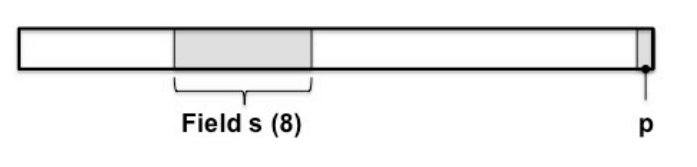

# Exercise 1

With reference to a perfect cipher,

1. State the Shannon's formal definition of perfect cipher and give an intuitive explanation of the definition.
    
2. Prove that, in a perfect cipher, the number of keys cannot be smaller than the number of messages.

3. Argue whether an asymmetric cipher can be perfect or not.

## Solution

(1) The definition of perfect cipher (Shannon's perfect secrecy) is the following one:

> Given a cipher defined over {K, P, C}, where 1) K is the key-space, 2) P is the plaintext space, 3) C is the ciphertext space. Given a random variable X defined over P as well as a random variable Y defined over C (X and Y can have any probability distribution), Shannon's perfect secrecy is defined as follows:
    for any x in X, for any y in Y ==> Pr(X = x | Y = y) = P(X = x)

An intuitive explanation of the definition could be the following: A perfect cipher should not reveal any additional information to an attacker who can eavesdrop on ciphertexts. In other words, for an attacker with only ciphertexts at their disposal, a good perfect cipher should not provide any additional information in terms of probability compared to the information the attacker had before eavesdropping on the ciphertext.
  
(2) Shannon's Theorem: In a perfect cipher ==> |K| >= |P|

Proof:

1. Let'us assume that in a perfect cipher, the number of keys would be less than the number of plaintexts, that is, |K| < |P|. This assumption we'll lead us to a contradiction.
    
2. Assuming that |K| < |P|, in order for the cipher to be invertible, it's reasonable to say that the number of ciphertexts must be larger or equal than to the number of plaintexts. In other words, |C| >= |P|. If |C| < |P|, there would be at least a pair of different plaintexts whose images through the cipher fall in the same ciphertext. In such a scenario, the cipher could not be invertible. 
    
3. It follows that |C| > |K|. Let's consider a plaintext Pr(X = x*) <> 0. Then, if we encrypted the plaintext using all the keys, there would be at least a ciphertext y* that is not image of x* for any key (it must exists because |K| < |C|). 

4. We found a contradiction: Pr(X = x* | Y = y*) = 0 which is not equal to Pr(X = x*).

(3) An asymmetric cipher cannot be a perfect cipher. Let's prove it: 

1. Consider the following encryption scheme.
        [M1] Bob --> Alice: y = E(pubkA, x)
Let's assume that Bob knows the authentic Alice's public key. The encryption scheme is based on any asymmetric cipher (what we are trying to prove does not depend on the particular asymmetric encryption scheme).
    
2. Let' consider an attacker with cipherext-only capability. (S)he is able to obtain any ciphertext (s)he wants. Let's say the attacker eavesdrops on ciphertext y*.

3. Since pubkA is publicly known, the attacker the mount the following attack:
    
    A. Find x' in P such that Pr(X = x) <> 0.
        
    B. Compute E(pubkA, x') = y'.
    
    C. If y' == y then Pr(X = x* | Y = y) = 1. In the opposite case, Pr(X = x* | Y = y) = 0.
    
    D. The attacker is able to gain additional knowledge in both cases: an asymmetric cipher is not a perfect cipher.

---

# Exercise 2

State the security definition of a Message Authentication Code (MAC).

List and briefly introduce the main methods of building a MAC out of other cryptographic primitives.

Show that the rawCBC-MAC (see figure) is insecure. Hint: compute the MAC t1 of the single block message m1 and the MAC t2 of the two-block message m2 = (m1, m1 xor t1). Generalize the attack for an arbitrary number of blocks message.

## Solution

(1) A Message Authentication Code is secure if it is computation resistant. Let's define the thread model:

- Consider an attacker who can run a chosen-message attack, that is an attacker is able to submit any message (s)he wants and (s)he obtain the respective legit tags. So, an attacker can obtain <$\mathsf{x_1, t_1}$>, ..., <$\mathsf{x_n, t_n}$>.

- A MAC scheme is said to be **computation resistant** if, with respect to an attacker with chosen-message capability, for any possible key $\mathsf{k}$ and for any number of different pairs <$\mathsf{x_1, t_1}$>, ..., <$\mathsf{x_n, t_n}$>, it is *computationally infeasible* to compute a legit tag $\mathsf{\hat{t}}$ for a new message $\mathsf{\hat{x} \notin \{x_1, ..., x_n\}}$.

(2) Mainly, there are two ways to build a MAC scheme:

- Hash based MACs. There are many ways to build a MAC scheme starting from a secure hash functions. Also, there many ways to build insecure MAC scheme from a hash function (*prefix* and *suffix* schemes). A better way to build a MAC scheme from hash functions is the HMAC design.

- Block cipher based MAC scheme (CBC-MAC). The latter works just as a CBC mode block cipher with minor (but fundamental) changes. The output of the CBC mode block cipher is once again encrypted by means a different key w.r.t. to the key used during the "encryption" phase.

(3) `raw-CBC` is insecure with respect to a chosen message attack (`raw-CBC` suffers existential forgery). Let's analyze the attack:

1. An attacker obtains a tag $\mathsf{t_x}$ computed from a one-block message $\mathsf{x}$ (where `sizeof(x) = b` bits).

2. The attacker forges a tag $\mathsf{t_{x}' = t_{x}}$ for the two-block message $\mathsf{x' = (x, x \oplus t_{x})}$. Tag $\mathsf{t_{x}'}$ is considered legitimate because:
    
    a. The first round of raw-CBC will output $\mathsf{t_{x} = E(K, x)}$.
    
    b. The second round of raw-CBC will output $\mathsf{t_{x}' = E(K, t_{x} \oplus (x \oplus t_{x})) = E(K, x \oplus (t_{x} \oplus t_{x})) = E(K, x) = t_{x}}$.

How should the message be forged in order to have a "legitimate" tag for any desired message? The message $\mathsf{x'}$ would be structured as follows:
$$\mathsf{x' = (x, x \oplus t_x, ..., x \oplus t_x)}$$

---

# Exercise 3

Let us assume that a plaintext P has the format specified in the figure where $\mathsf{s}$ is an 8-bit field that specifies an amount of money and $\mathsf{p}$ is a parity bit s.t. $\mathsf{p}$ is 0 if the number of 1s in the plaintext (bit $\mathsf{p}$ excluded) is even; it is 1 otherwise. The whole plaintext is encrypted by means of one-time-pad. 

    
     

1. Does this encryption scheme suffer from malleability? Motivate the answer.
2. Assume that field s specifies the value 130. Argue whether and how, it is possible to modify the cipher-text so that the decrypted plaintext specifies 146 in the field $\mathsf{s}$ and such a modification goes undetected.
3. Propose a possible countermeasure.
